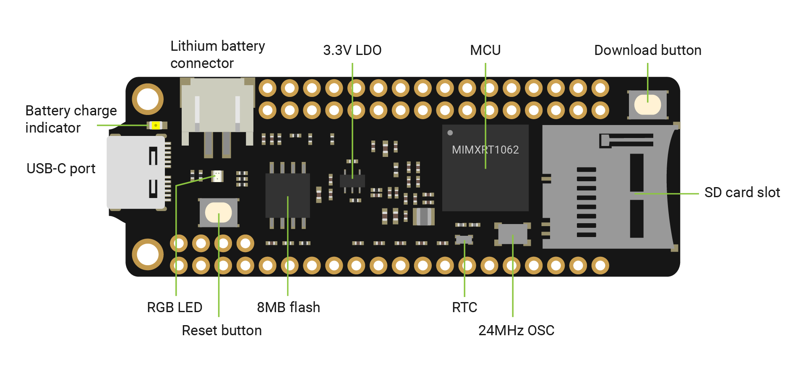

## What is "Embedded, Bare-metal, Real-time, Microcontroller, Arduino, Raspberry Pi"

Sorry to put so many technical terms at this beginning. I met so many people who felt confused about these terms. Of course, you will because it's hard to find any precise definitions if you google them. First, I'll give a brief explanation about them.

* **Embedded**: At the very beginning, the meaning of embedded application is pretty intuitive. It refers to a kind of software built into any machine other than a general-purpose computer. But its meaning is becoming vague and confused nowadays. You could find so many different explanations with google. I prefer the one on [wikipedia](https://en.wikipedia.org/wiki/Embedded_software): **If the main software functions are not initiated/controlled via a human interface, but through machine-interfaces, you could call it embedded application**, from simple firmware that controls the microwave oven to complicated Android-based automotive HMIs. Many people might think it is relevant to the complexity and performance of applications, or if an OS is used, and that’s not the case. 

* **Bare-metal**: This term means your code runs on the hardware directly, without any typical OS. It has nothing to do with specific hardware. You can write a bare-metal program on a simple microcontroller or (possibly) on a complicated x86-64 machine.

* **Real-time**: Real-time programs must guarantee a response within specified time constraints, often referred to as "deadlines". In short, the operation time must be [deterministic](https://www.electronicdesign.com/technologies/embedded-revolution/article/21767162/determinism-means-more-than-faster-processors). You can write a real-time program on the hardware directly (Bare-metal) or based on a real-time OS. BTW, the typical OS such as macOS, Windows, Linux, iOS, Android, none of them guarantee real-time, so it's really hard (most time impossible) to write a real-time program based on those platforms.

* [**Microcontroller/MCU**](https://en.wikipedia.org/wiki/Microcontroller): A microcontroller is a small computer combined with various peripherals. Most of the peripherals are used to communicate with external machines or sensors. **Typically, a microcontroller contains everything (CPU, ROM, RAM, peripherals) in a single chip.** You just need to power it up, then code execution begins. Normally, the microcontroller's performance/complexity is much less than any regular computer, so developers prefer to write their application directly on the hardware (Bare-metal). But the situation is changing in recent years. Many microcontrollers are becoming more and more powerful and complex rapidly. It's more challenging to develop bare-metal applications on them.

* [**Arduino**](https://www.arduino.cc/): A very famous brand/company that produces a series of microcontroller boards. The boards can be programmed using C or C++. The greatest advantage of Arduino is the massive amount of C/C++ libraries and the huge community. When programming an Arduino board, you are actually doing **bare-metal** programming. However, you don't need to deal with the low-level hardware details because Arduino provides a series C/C++ API, which is very easy for software engineers to get started.

* [**Raspberry Pi**](https://www.raspberrypi.org/): RPi looks like Arduino, but it's totally different. RPi is a general-purpose computer but small in size (also very cheap). The hardware architecture is similar to a cellphone or tablet. It can run the standard Linux. **It's the same to develop an RPi application as any other Linux applications.** RPi does provide some peripherals, so you can use it to communicate (through Linux driver API) with external sensors. I think thie is the only similarity with Arduino.


## The difference when programming for a general-purpose computer and an embedded one

After knowing those terms above, you may find out the main difference between a normal application and an embedded application: **the former targets humans while the latter targets machines**.

A normal application runs on general-purpose computers in our daily life: PC, Mac, Cellphone, tablet, etc. On those computers, people can install any application they like, run them simultaneously. In this situation, the computer is controlled by a human interface. **The primary task of the OS is to guarantee all the apps/processes won't affect each other.**

By contrast, the application in an embedded device mainly focuses on machines. All demands are fixed. Therefore, **only one dedicated application is running normally.**

### Hardware difference: MMU

It's not hard to tell many differences between a general-purpose computer and an embedded device/microcontroller. But don't be confused by those intricate details. IMHO, there's only one key difference: if there is a [**memory management unit**](https://en.wikipedia.org/wiki/Memory_management_unit) (MMU).

MMU is a computer hardware unit that decides whether the CPU supports a general-purpose OS. It gives OS the capability to run multiple apps/processes simultaneously. Each process has its own virtual address space. MMU maps them to the actual physical RAM.

By contrast, the microcontroller is used under a more stable circumstance. It doesn't need to support multiple processes. **All the code, including application, libraries, OS (if you have one) share the same address space.** Besides, all the hardware components such as ROM, RAM, peripherals are also mapped into the same address space.

The single address space greatly simplifies the compute architectures, and it brings another characteristic of the microcontroller: where the application is stored.

We know **a normal application is stored at the external storage**, such as hard driver, SSD, EMMC, SD card etc. File system allows the OS to find and load the exact application. The OS needs to copy the application into RAM before running. Then the CPU and MMU can work together to translate the memory addresses and run the app.

When you develop an application for the microcontroller, **all addresses are fixed after linking**. Then you could put the application in the ROM, which has its own address. So it takes only a few milliseconds to run your code after the device power-up. It's called **execute in place (XIP)**. 

### Software difference: Operating system

As a Swift programmer, you must be familiar with app development on macOS or iOS. The OS manages computer hardware, software resources, and provides common services for applications. The OS is like a huge black box. All the resources are restricted to the system API. **You can not talk to the hardware directly but through a batch of system APIs.** Any simple application might depend on many hidden system-level libraries (most of them are dynamic linked). The OS will help to invoke these libraries at run time. 

By contrast, **every microcontroller application is self-contained**. It means all the stuff are static linked together, including the application code, dependent libraries and the OS itself. In such context, the OS is normally provided at the source code level (sometimes binary), and you could consider it a normal scheduler library like any other dependencies. Actually, there is a term to describe such kind of OS: [**Library operating system**](https://en.wikipedia.org/wiki/Operating_system#Library).
 
In most cases, the software arch for microcontrollers is much simpler than the one on general-purpose computers. In such situation, the OS is just another dependency, you can even modify (but not recommend) the OS if you need.

## Why Swift and How?

### Background

C is still a popular language for low-level embedded programming. That’s because:

* **C is the most widely supported language by various hardware archs in the embedded world.** It is considered a kind of portable assembler. You don’t have any other choices if you are targeting a rarely-seen hardware platform.

* Even though the absolute quantity of embedded devices is huge, **most of them need relatively simple software architecture**. In such cases, you don’t need to use a higher abstraction provided by modern programming languages.

In recent years, the embedded device evolves and hence both the performance and complexity increase rapidly. Embedded engineers are trying different ways to handle the increasing complexity. There comes Arduino (C++), MicroPython, Espruino (JavaScript), TinyGo (Golang), Meadow (C#), etc. But except C++, none of those languages are designed for system-level programming naturally.

As I know, only Swift and Rust announce themselves are (modern) system-level languages in recent decades. When I first have the thought of porting Swift to the embedded world, I have compared Swift and Rust carefully. My conclusion is that Rust is too complicated for application development. But now, **in 2022, you can see Rust has already gained a reputation as a system-level programming language**. More and more people try to use Rust in [**embedded development**](https://www.rust-lang.org/what/embedded) and they have really [**active community**](https://github.com/rust-embedded). Unbelievable, are people gluttons for punishment nowadays😅? Come on! Swift! We can do this!

Here are some typical features a system-level language should have:
* Compiled language
* Easy to interact with C API
* Strong type
* Fast
* No GC
* Deterministic

Both Swift and Rust have these features. Unfortunately, Swift isn’t that fast and deterministic as Rust currently. Because there are many hidden operations behind the code, and it’s hard to find them out now. Since the core team has put this as a main goal in [**Swift 6**](https://forums.swift.org/t/on-the-road-to-swift-6/32862), I believe everything is ready for Swift in the embedded world.

### Cross compile

As we all know, any programming language is translated into assembly at last (I won’t discuss interpreted language here, they are relatively slow compared to compiled languages).

Swift/LLVM toolchain is naturally a cross compiler. It provides an easy way to translate the Swift code for different hardware architectures. 

Here is a very simple demonstration:

```swift
func empty() {
	return
}
```

We have an `empty.swift` here, you could use such command to translate it into assembly for different hardware arch:

```bash
swiftc -target x86_64-apple-macosx12.0.0 -c empty.swift
```

Depending on your platform, you may meet the error:

```bash
error: unable to load standard library for target ***
```

Just add the `-parse-stdlib` arg, it tells the compiler to not look for the Swift standard library. Like this:

```bash
swiftc -target x86_64-apple-macosx12.0.0 -parse-stdlib -c empty.swift
```

Changing the **target**, you could translate the source code into object files for different archs/systems. Here are some examples:


* `x86_64-apple-macosx12.0.0`
* `x86_64-unknown-windows`
* `x86_64-unknown-linux`

* `arm64-apple-macosx12.0.0`
* `arm64-unknown-linux`
* `arm64-apple-ios15.0.0`


In the current MadMachine project, I added the target `thumbv7em-none-unknown-eabi` for ARM Cortex-M series microcontroller to the Swift toolchain. Thanks to the nice framework of Swift/LLVM project, it’s super convenient to enable a new target.

So is that done? Can you write Swift code for Cortex-M microcontrollers now? Not yet!

### Runtime

As you can see in the demonstration, there’re only two hardware archs: x86_64 and arm64. But what are those OSes doing here? Since the archs are the same, shouldn’t they have the same assembly? Technically, it should be. But **your Swift code needs the help of some fundamental functions provided by the OS**.

For example, when you create an instance of a class in Swift code, you need some memory space in the heap. Different OS might have different API for this operation. So Swift toolchain implemented a very fundamental abstraction layer to cover these differences. This (library) is called Swift [**Runtime**](https://github.com/apple/swift/tree/main/stdlib/public/runtime) and it’s implemented in C++ ([so it can interact with OS's C API directly](https://gankra.github.io/blah/c-isnt-a-language/)). In the example above, the function is [**swift_allocObject**](https://github.com/apple/swift/blob/b952184adffd228a4e6673137972b338bd34a7b3/stdlib/public/runtime/HeapObject.cpp#L137). The runtime is used for very low-level management such as casting, ARC, metadata, etc. It’s not something magic, but another low-level library. BTW, you can not access this Runtime library in Swift code directly, it is only used by the Swift compiler when necessary.

If you want to use Swift on some new archs or OSes, you need to connect the Runtime invocations with the OS API first, or at least stub them out. Once you implemented those APIs used by the Runtime, most of the Swift code can run correctly. 

### Connect Swift Runtime to Zephyr

As I mentioned before, embedded devices are becoming more complex and have higher performance. For the MadMachine project, I chose NXP RT10xx series microcontroller which has a 600MHz ARM Cortex-M7 core and various complex peripherals. It’s not easy to leverage all the capabilities on bare-metal.

So I use a Real-time OS named [**Zephyr**](https://www.zephyrproject.org/). It is a Linux Foundation project which focuses on the area that Linux can’t cover. It provides a batch of standard APIs to access the low-level peripherals. Many semiconductor companies such as NXP contribute to implementation for these APIs. So you don’t need to spend that much energy on the low-level details when developing an application.

The Zephyr Real-time OS is provided via [**source code**](https://github.com/zephyrproject-rtos/zephyr), and it uses Kconfig to configure the kernel (just like the Linux kernel). **A normal C application based on Zephyr is compiled with the OS source together**. But for a specific hardware, you could compile the whole OS layer as a library and use it at linking time. This is how the MadMachine project works.


### Swift standard library

After the Swift Runtime and Zephyr are connected, all the difficult parts are done. Now you can cross compile the whole Swift standard library into the expected target: `thumbv7em-none-unknown-eabi`.

Then a new problem appears. As I have said before, a microcontroller application needs to static link all stuff together. **The Swift std is such a huge library that the binary size is bigger than 2MB**. Currently, this size is unacceptable on most microcontrollers (ROM size < 2MB is still the mainstream).

In the traditional C developing, it’s very easy to enable the linking time optimization to reduce the application binary size:
1. Separate each C functions/data into different segments while compiling to object files.
2. Eliminate those segments not used in the application when linking.

But Swift uses some new technologies such as metadata, causing this kind of optimization not that useful. Because the linker cannot infer if those functions/data are used in those object files now.



Currently, the MadMachine microcontroller board includes a 32MB external RAM. The application binary is linked to the RAM start address. Developers need to copy the application binary to the onboard SD card. After board power-up, the firmware in the ROM will copy this application to the specific RAM address and then begin execution.

Remember what is XIP? Yes, this board does contain an 8MB ROM. Technically you could link your application to the ROM address and write to the ROM, so you don’t need the SD card anymore. (It’s relatively slow to write data to the ROM)

## Room for improvements

### Language evolve

As I mentioned before, the Swift team would pay attention to the performance and deterministic in Swift 6. They are the most important features to program in the embedded world. I'll list them here:

* Performance
* Deterministic


### Binary size

Next, the binary size becomes a critical problem. Even if the hardware would evolve over time, we must try to improve the situation. At present, there are mainly two ways:

* **Implement [another Swift standard library](https://github.com/compnerd/uswift) dedicated for constrained environments**
    
    This would be the only choice for some low-end microcontrollers (They may have only 64KB ROM or even lower). But in such situation, I think people prefer to use C rather than any kinds of modern languages.

* **Keep the current Swift std, but make it more convenient for link time optimization**

    Personally I prefer this way. In many cases, people chooses a language not because the language itself, but the powerful built-in functions and mass libraries. We’d better try our best to keep the fundamental std the same so we can leverage the whole ecosystem rather than the language syntax.

Unlike Rust implementing its standard library into [two parts](https://docs.rust-embedded.org/book/intro/no-std.html) (core and std), the Swift std is designed high coupling as a whole module due to performance requirement. This makes it hard to reduce its size. Even if you use a standard `Int` type or simple assignment statements, you have to import the whole standard library.

BTW, Swift team is working hard for linking time optimization technology. We just don’t know how well it would be for reducing the binary size. Hope it would work great! 

### Concurrency

Swift has added this missing part in Swift 5.5. I haven't looked into it carefully. Seems the main part is implemented as a runtime level [**library**](https://github.com/apple/swift/tree/main/stdlib/public/Concurrency). It dependes on the externel [**libdispatch**](https://github.com/apple/swift-corelibs-libdispatch) which depends on a series of OS APIs such as pthread (Plz correct me if I'm wrong).

Wow, this is really unfriendly for Bare-metal or RTOS development. We still have a tough nut to crack.


## Summary

The embedded/bare-metal development has already existed near half a century. It is equivalent to assembly or C programming in such a long period. In recent years, it becomes more and more difficult due to the rapid evolvement of embedded hardware. The whole industry is in urgent need of some new ways to improve the situcation. But still, there is no result. And Swift is really suitable in such use case.

IMHO, it’s more easy for Swift to expand into a brand new and growing field rather than replace other lanugages in some existing scene. Especially, there’s almost no competitor in this area.

Since the [**global chip shortage**](https://en.wikipedia.org/wiki/2020%E2%80%93present_global_chip_shortage) started in 2020, we have paused the hardware development until we can purchase the core components. Please [**stay tuned**](https://twitter.com/madmachineio). This must be cool and fun!