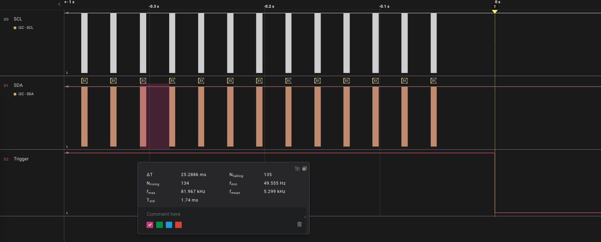

## What's the problem 

A 1602 LCD is connected to the I2C interface and will show an increasing value with time. After a random period, the LCD freezes and doesn't show the updated value any longer.  

## How to find out the cause

### Step 1

At first, I add a blue LED to the circuit and make it blink repeatedly once an error happens. Besides, I add a digital pin (trigger) and set it to low when an error happens.

Thus, I find that when the LCD stops working, the LED blinks, which means the main program works. 

As shown below, the I2C data is sent regularly at first. Then an error happens, I2C reports I/O error, and the trigger pin is set to low (marked with a yellow dotted line). The last I2C data before the error is sent normally. So there's something that causes the I2C communication failure.

### Step 2

Accidentally, when I plug other connectors into the same USB hub to which the SwiftIO is connected, the LCD stops working. 

So I tried to plug other power-consuming devices into the USB hub and find that the I2C communication will easily fail. I wonder if it's related to the power issue.

### Step 3

Then I try to sample the actual analog voltages on the bus and FINALLY notice a small glitch in the signal which causes the I2C communication error.

The voltage on the SDA line decreases to about 2.9V when I plug another device into the hub, so the glitch interferes with the signal. The master thinks the communication is going on the bus and waits for a stop signal. So I2C is kept in busy mode. 

## About I2C

Let's first take a look at I2C. I2C is a two-wire protocol that is used to connect multiple devices to a single bus. It is suitable for short-distance communication. 

The I2C bus consists of two lines: the serial data line (**SDA**) and the serial clock line (**SCL**). The master device generates the clock signal on the SCL line, and the devices on the bus use this clock to synchronize their communication. Data is transmitted on the SDA line.

I2C devices have a unique **address**, and each device on the bus can be independently addressed by the master. The master device can initiate communication with a specific slave device by sending its address, and the slave device will respond if it matches the address. Then, the master device can send or request data from the slave device, which is transmitted on the SDA line.

I2C is designed for short-distance communication, typically on a single PCB (printed circuit board) or within a small device. Longer bus lines can have more noise and crosstalk that can affect the signal integrity and cause errors.

### Push-pull and open-drain

The I2C uses open-drain outputs. There are two kinds of output: push-pull and open drain:
* A **push-pull** output can **both source and sink current**. This is how it got its name since it pushes the signal high and pulls it low.  

    In a push-pull circuit, two active devices are used to drive a load. One device is used to "push" current into the load, while the other device is used to "pull" current out of the load. The two devices switch back and forth, following the input signal, to create the output.

    It can drive a signal over a longer distance and have less susceptibility to noise compared to open-drain outputs.

    

* In contrast, an **open-drain** output can only **sink current**.

    An active device is used to pull the output voltage to a low state, but does not actively drive it to a high state. It acts like a switch that connects the signal line to the ground, pulling the voltage level of the signal line low. This is called "drain" because it is "draining" current away from the signal line. And if it is turned off, the signal line is in an "open" state, not connected to either power or ground. This means that there is no current flowing through the line and it would float.

    

    To drive the signal high, an external pull-up resistor can be used to connect it to the high voltage level (Vcc), which will pull the output high when no other device is actively driving the signal. This means that the current flowing through the pull-up resistor is sourced by the voltage source, not by the open-drain output.

    The use of Open-drain outputs is useful in situations where multiple devices need to share a single communication line, such as the I2C bus. 

Since open-drain outputs can only drive a signal low and not high, it allows multiple devices on the bus to pull the SDA or SCL line low without any conflicts.

### I2C Pull-up resistor 

I2C bus uses open drain output, hence it needs external pull-up resistors. 

The value of the pull-up resistors can affect the charging and discharging time of the bus capacitance, which in turn can affect the rise time of the signals on the bus. The capacitance refers to the total capacitance present on the SDA and SCL lines, including the parasitic capacitance of the devices and any additional capacitors that may be present. It makes the voltage level on the two lines cannot change instantaneously. When a device changes the line state, it causes a charging or discharging process of the bus capacitance, which takes a certain amount of time known as the rise time and fall time.

Why the falling time of a signal is usually shorter than the rising time? When a device pulls the SDA or SCL line low, the bus capacitance is effectively discharged through the device's open-drain output. Since the output is actively pulling the line low, the transistor acts as a switch with very low internal resistance and the discharge time is relatively short.

When a device releases the SDA or SCL line, the bus capacitance is charged through the pull-up resistor. Since the device is no longer actively pulling the line low, the charge time is determined by the value of the pull-up resistor and the total capacitance of the bus. A higher value pull-up resistor or larger bus capacitance results in a longer charge time, and therefore a longer rising time.

* A "strong" pull-up is one with relatively low resistance. It allows for a faster charging of the bus capacitance when the lines are released, which results in a faster bus speed and better performance in high-speed I2C applications. However, it also increases the power consumption on the bus.

* A "weak" pull-up is one with relatively high resistance, which increases the charging time of the bus capacitance when the lines are released. This can result in slower communication speeds and a higher probability of errors on the bus. It may be suitable for low-speed or low-power I2C applications. 

By default, the I2C interfaces on the SwiftIO board have 4.7kΩ pull-up resistors. So you don't have to add external pull-up resistors when connecting other I2C devices.

## Solution

Now back to our problem. As stated above, the I2C signal can easily be affected by noises and disturbances. Then I found that the MCU provides an I2C glitch filter.

The I2C glitch filter is used to filter out short, unwanted pulses or glitches on the SDA and SCL lines of an I2C bus. It is typically a simple low-pass filter to remove any high-frequency noise that may cause errors in communication.

After I turn on the filter and run the test again, the communication never fails again.

## Go further: Schmitt trigger

When I check the datasheet, I notice that the MCU adds an I2C glitch filter for the I2C interface, and for GPIO, it provides a Schmitt trigger to filter noises.

In a digital input circuit, the input signal is typically an analog signal, such as a voltage, which needs to be converted into a digital signal that can be understood by the digital logic of the system. Schmitt triggers are commonly used in digital input circuits to provide noise immunity and improve signal quality. It compares the input signal to two different threshold voltages, typically a high threshold and a low threshold. When the input voltage exceeds the high threshold, the output goes high. When the input voltage falls below the low threshold, the output goes low. 

Since the Schmitt trigger has hysteresis, the threshold voltages between high and low states, there is a range of input voltage where the state doesn't change even though the input voltage is changing. This property allows the Schmitt trigger to ignore small voltage fluctuations that would otherwise cause false triggers.

For example, when a mechanical switch is pressed, it can bounce multiple times before settling in its final position. This bouncing can cause the switch's contacts to make and break multiple times, which can result in multiple, rapid-fire switching actions. A Schmitt trigger can be used to filter out this noise.
* When the button is pressed (or released depending on your circuit), after the input voltage rises above the high threshold, the Schmitt trigger's output changes to a high level, indicating that the button has been released.
* When the button is released (or pressed depending on your circuit), after the input voltage falls below the low threshold, the Schmitt trigger's output changes to a low level, indicating that the button has been pressed. 

Therefore, it ensures that the input is interpreted as a single, clean transition.

While Schmitt triggers are often effective at suppressing noise on digital input signals, there may still be some noise present even after adding a Schmitt trigger to the circuit. This may be due to the sufficient hysteresis of the Schmitt trigger to filter out all the noise present on the input signal. Or the amplitude of the noise on the input signal may be larger than the hysteresis of the Schmitt trigger, making it impossible for the circuit to filter it out. Therefore, a combination of different types of filters or even other debounce techniques may be needed to achieve the desired level of noise suppression.

The MCU has the Schmitt trigger on all GPIOs. It's configured by default, I cannot change its setting but only turn on/off it. So there may be still some noises when using these pins. So when I am working with a button, I tend to add a simple RC filter, made up of a resistor and a capacitor, for button debounce. 

