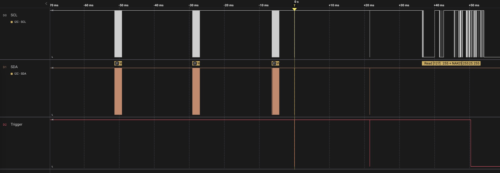
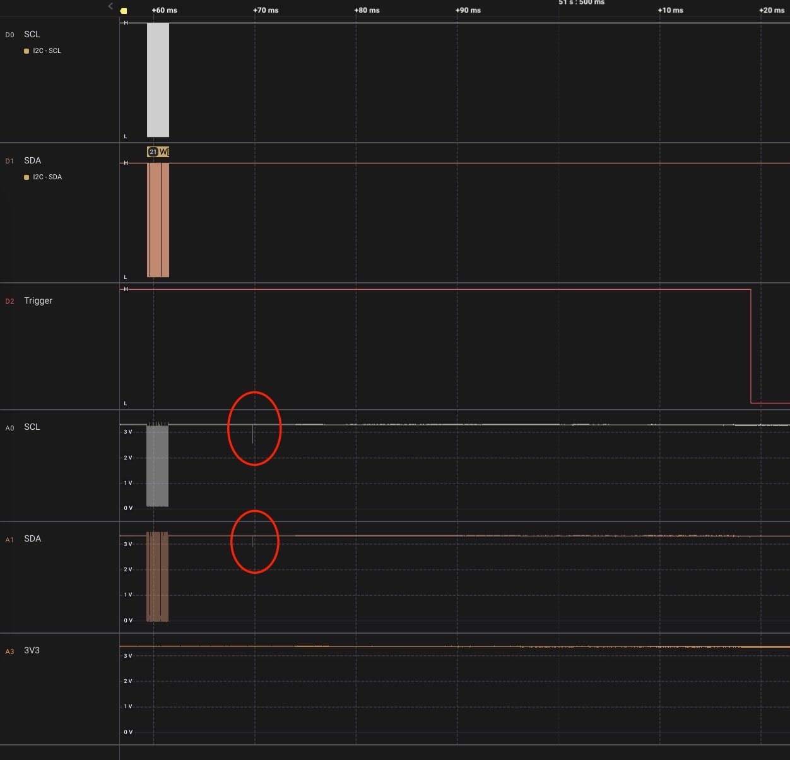
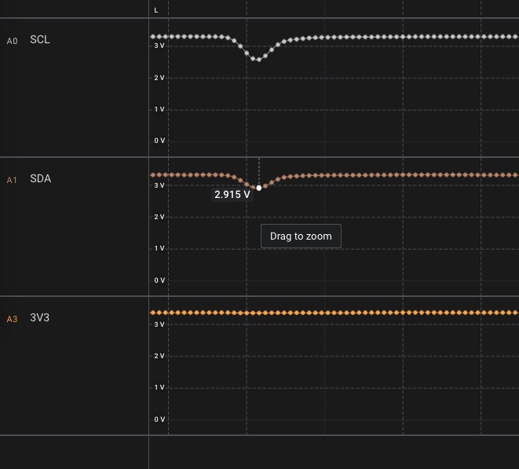
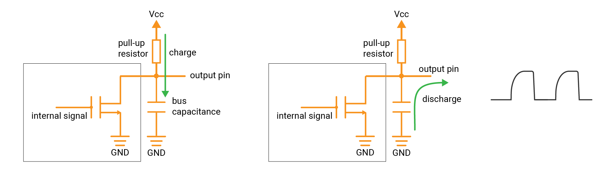
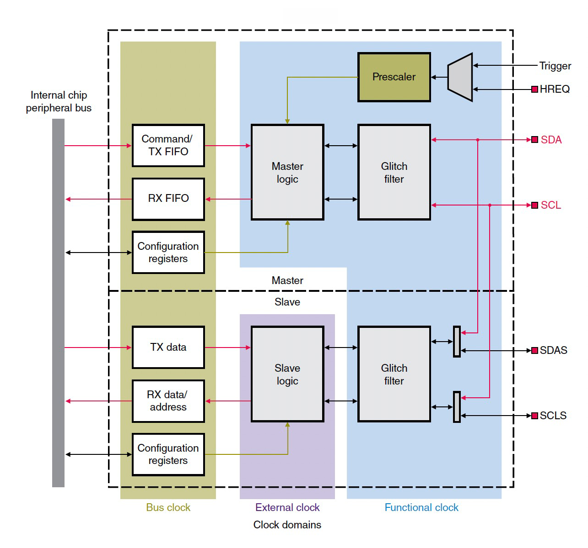
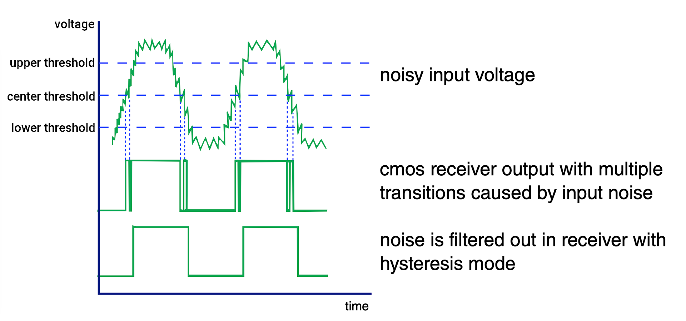

I personally find the SPI protocol to be more favorable than I2C, as the I2C protocol has several additional features that make the protocol more complex to implement and more prone to communication errors. Recently, a member, [Jimmy](https://github.com/jhoughjr), in our [discord community](https://madmachine.io/discord) encountered an I2C communication failure. So I researched the issue in more depth to understand and solve the problem. I would like to share my findings.

<!-- truncate -->

## What's the problem 

A 1602 LCD screen that was connected to the I2C interface was displaying an incrementing value over time. However, unexpectedly, after an indeterminate period, the screen froze and stopped displaying the updated value.

## How to find out the cause

### Step 1


To understand the cause of the problem with the 1602 LCD screen, I decided to observe the I2C signals. To do this, I added a digital trigger pin and configured it to go low when an error occurs. This would allow me to visualize the I2C signals and detect any issues with the communication. Here is my test code:


```swift
import SwiftIO
import MadBoard
import LCD1602

@main
public struct I2CIssue {
    public static func main() {
        var seconds = 0

        let i2c = I2C(Id.I2C0)
        let lcd = LCD1602(i2c)
        lcd.write(x: 0, y: 0, "Hello SwiftIO!")

        let trigger = DigitalOut(Id.D0)
        trigger.high()

        var ret = true
        while true {
            seconds += 1
            sleep(ms: 20)

            // Display the new value on the LCD.
            ret = lcd.write(x: 0, y: 1, "\(seconds)s")
            // If an error happens, change the state on trigger pin.
            if ret == false {
                trigger.low()
                seconds = 0
                break
            }
        }

        while true {
            sleep(ms: 200)
        }
    }
}
```


As shown below, the I2C signal appears to be working normally at first, then an error happens, the I2C reports an I/O error, and the trigger pin is set to low, which is indicated by a yellow dotted line. The last I2C data before the error was sent without any issue, which indicates that something is causing the I2C communication failure.




### Step 2

The problem with the I2C communication and the LCD screen was difficult to reproduce consistently. Despite multiple attempts, I was unable to consistently replicate the issue, making it hard to pinpoint the exact cause of the failure😔.

Fortunately, I did discover that when other connectors were plugged into the same USB hub as the SwiftIO board, the LCD would stop working. This provided a clue towards identifying the cause of the problem🧐.

Further investigation revealed that the I2C communication would fail when power-consuming devices were connected to the USB hub. This led me to suspect that the issue may be related to a power problem.

### Step 3

After trying to sample the actual analog voltages on the bus, I **FINALLY** noticed a small glitch in the signal which causes the I2C communication error.

I discovered that when another device was plugged into the hub, the voltage on the SDA line dropped to around 2.9V, causing the glitch which interfered with the signal. The master device thought that communication was still ongoing on the bus and waited for a stop signal, thereby keeping the I2C in busy mode.







## About I2C

Let's first take a look at I2C. I2C is a two-wire protocol that is used to connect multiple devices to a single bus. It is suitable for short-distance communication. 

The I2C bus consists of two lines: the serial data line (**SDA**) and the serial clock line (**SCL**). The master device generates the clock signal on the SCL line, and the devices on the bus use this clock to synchronize their communication. Data is transmitted on the SDA line.


Each I2C device has a unique **address**. The master device can initiate communication with a specific slave device by sending its address, and the slave device will respond if it matches the address. Then, the master device can send or request data from the slave device, which is transmitted on the SDA line.


I2C is designed for short-distance communication, typically on a single PCB (printed circuit board). Longer bus lines can have more noise and crosstalk that can affect the signal integrity and cause errors.

### Push-pull and open-drain

The I2C uses open-drain configuration. There are two kinds: push-pull and open-drain:
* A **push-pull** output can **both source and sink current**. This is how it got its name since it pushes the signal high and pulls it low.  

    In a push-pull circuit, two active devices are used to drive a load. One device is used to "push" current into the load, while the other device is used to "pull" current out of the load. The two devices switch back and forth, following the internal signal, to create the output.

    It can drive a signal over a longer distance and have less susceptibility to noise compared to open-drain outputs.

    

* In contrast, an **open-drain** output can only **sink current**.

    An active device is used to pull the output voltage to a low state, but does not actively drive it to a high state. It acts like a switch that connects the signal line to the ground, pulling the voltage level of the signal line low. This is called "drain" because it is "draining" current away from the signal line. And if it is turned off, the signal line is in an "open" state, not connected to either power or ground. This means that there is no current flowing through the line and it would float.

    

    To drive the signal high, an external pull-up resistor can be used to connect it to the high voltage level (Vcc), which will pull the output high when no other device is actively driving the signal. This means that the current flowing through the pull-up resistor is sourced by the voltage source, not by the open-drain output.

The use of open-drain outputs is useful in situations where multiple devices need to share a single communication line, such as the I2C bus. 


### I2C Pull-up resistor 

I2C bus uses open-drain output, hence it needs external pull-up resistors. 


The value of the pull-up resistors can affect the charging and discharging time of the bus capacitance, which in turn can affect the rise time of the signals on the bus. The capacitance refers to the total capacitance present on the SDA and SCL lines, including the parasitic capacitance of the devices and any additional capacitors that may be present. It makes the voltage level on the two lines cannot change instantaneously. When a device changes the line state, it causes a charging or discharging process of the bus capacitance, which takes a certain amount of time known as the rise time and fall time.

Why the falling time of a signal is usually shorter than the rising time? When a device pulls the SDA or SCL line low, the bus capacitance is effectively discharged through the device's open-drain output. Since the output is actively pulling the line low, the transistor acts as a switch with very low internal resistance and the discharge time is relatively short.

When a device releases the SDA or SCL line, the bus capacitance is charged through the pull-up resistor. Since the device is no longer actively pulling the line low, the charge time is determined by the value of the pull-up resistor and the total capacitance of the bus. A higher value pull-up resistor or larger bus capacitance results in a longer charge time, and therefore a longer rising time.



* A "strong" pull-up is one with relatively low resistance. It allows for a faster charging of the bus capacitance when the lines are released, which results in a faster bus speed and better performance in high-speed I2C applications. However, it also increases the power consumption on the bus.

* A "weak" pull-up is one with relatively high resistance, which increases the charging time of the bus capacitance when the lines are released. This can result in slower communication speeds and a higher probability of errors on the bus. It may be suitable for low-speed or low-power I2C applications. 


By default, the I2C interfaces on the SwiftIO board have 4.7kΩ pull-up resistors. So you don't have to add external pull-up resistors when connecting other I2C devices.


## Solution

Returning to the issue at hand, it was established that the I2C signal can be easily affected by external noises and disturbances. After further investigation, I discovered that the MCU has an I2C glitch filter feature that can be enabled to prevent these types of errors.





The I2C glitch filter is a useful feature that helps to prevent errors in communication caused by short, unwanted pulses or glitches on the SDA and SCL lines of the I2C bus. It is typically set to ignore pulses that are shorter than a certain duration, for example, in a 1MHz I2C bus, a cycle lasts for 1000ns, with 500ns for the high level and 500ns for the low level. By adding a 400ns glitch filter, any noise or disturbance shorter than 400ns will be filtered out, thus improving the reliability of the I2C communication by reducing the chances of errors caused by unwanted pulses.

After activating the I2C glitch filter and running the test again, the communication is much more stable, indicating that the filter successfully eliminated the unwanted pulses that were causing errors in the communication👏.


## Go further: Schmitt trigger

I found in the MCU's datasheet that it has an I2C glitch filter built-in, which is specifically designed to filter out unwanted pulses or glitches on the SDA and SCL lines of the I2C interface. Furthermore, it also provides a Schmitt trigger for the General Purpose Input/Output (GPIO) pins to filter out external noise and improve signal integrity.

In a digital input circuit, the input signal is typically an analog signal, such as a voltage, which needs to be converted into a digital signal that can be understood by the digital logic of the system. Schmitt triggers are commonly used in digital input circuits to provide noise immunity and improve signal quality. It compares the input signal to two different threshold voltages, typically an upper threshold and a lower threshold. When the input voltage exceeds the upper threshold, the output goes high. When the input voltage falls below the lower threshold, the output goes low. 



Since the Schmitt trigger has hysteresis, the threshold voltages between high and low states, there is a range of input voltage where the state doesn't change even though the input voltage is changing. This property allows the Schmitt trigger to ignore small voltage fluctuations that would otherwise cause false triggers.

For example, after a mechanical switch is pressed, the voltage may fluctuate for a certain period near the center threshold before settling in its final state. These fluctuations near the center threshold can be interpreted as multiple pulses. For example, once the voltage passes the center threshold, it is considered high, and if it falls a bit below that threshold, it becomes low again. This can cause errors in the digital signal, and the Schmitt trigger helps to filter out these unwanted pulses and ensure a clean transition in the signal.
* If the button is pressed (or released depending on your circuit), after the input voltage rises above the upper threshold, the Schmitt trigger's output changes to a high level, indicating that the button has been released.
* When the button is released (or pressed depending on your circuit), after the input voltage falls below the lower threshold, the Schmitt trigger's output changes to a low level, indicating that the button has been pressed. 

Therefore, it ensures that the input is interpreted as a single, clean transition.

While Schmitt triggers are often effective at suppressing noise on digital input signals, there may still be some noise present even after adding a Schmitt trigger to the circuit. This may be due to the sufficient hysteresis of the Schmitt trigger to filter out all the noise present on the input signal. Or the amplitude of the noise on the input signal may be larger than the hysteresis of the Schmitt trigger, making it impossible for the circuit to filter it out. Therefore, a combination of different types of filters or even other software debounce techniques may be needed to achieve the desired level of noise suppression.

The MCU has the Schmitt trigger on all GPIOs. It's configured by default, I cannot change its setting but only turn on/off it. So there may be still some noises when using these pins. So when I am working with a button, I tend to add a simple RC filter, made up of a resistor and a capacitor, for button debounce. 

