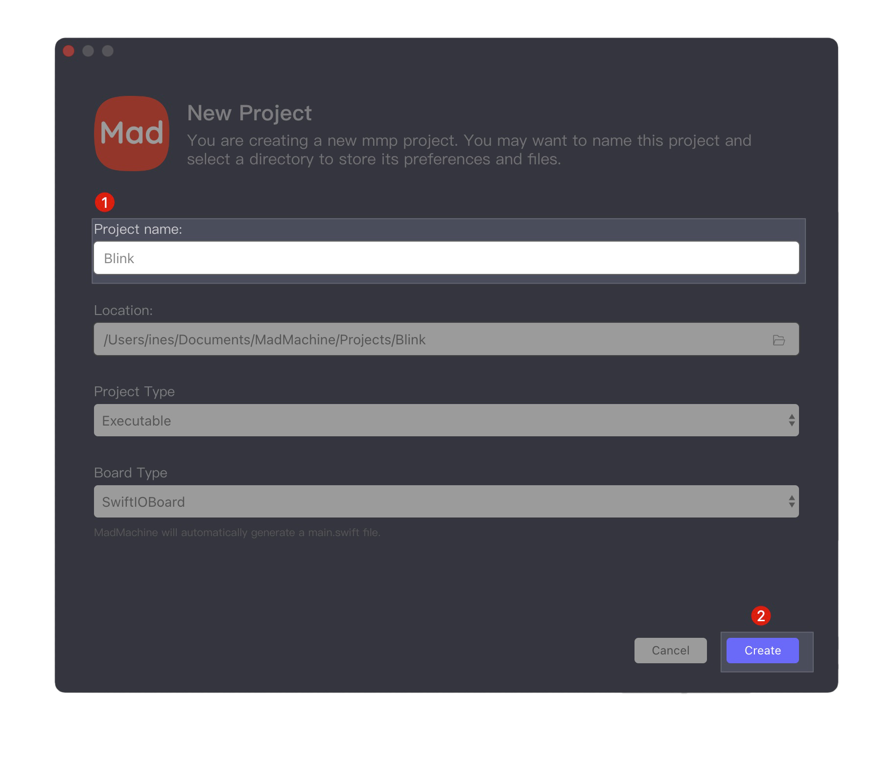
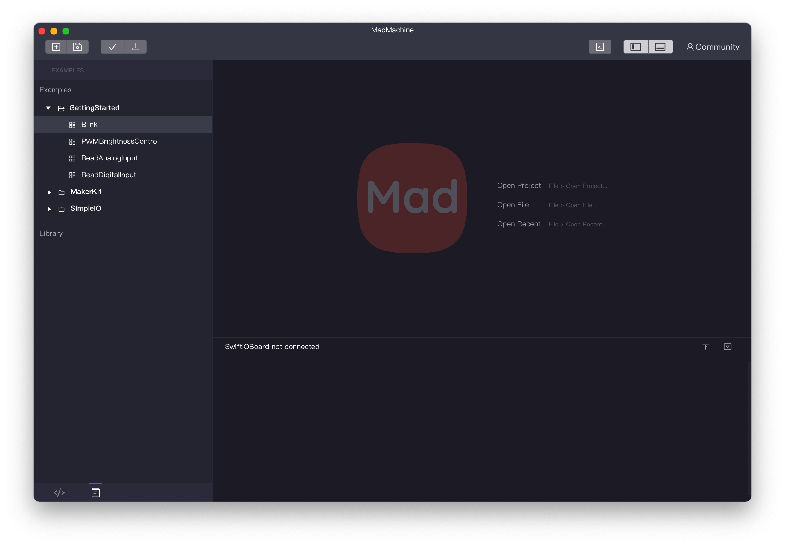
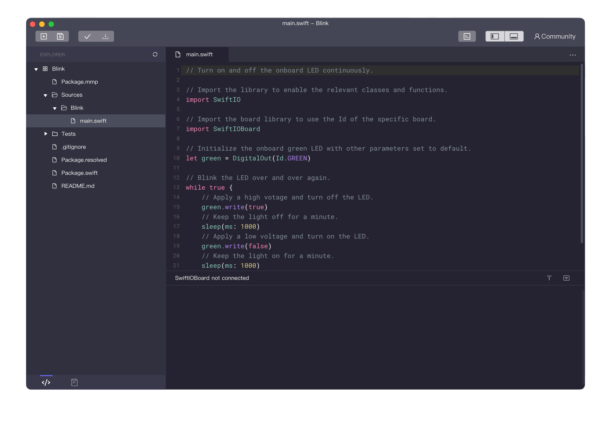

# Getting Started

So, you‘ve got your SwiftIO board. Let's start with a hello world project - LED blink. Follow us step-by-step to run your first project on the SwiftIO board.

## **Step 1: Download and install the MadMachine IDE**

At first, you need to download the MadMachine IDE. It is a simple tool to allow you to write the code and download it to your board.  

The IDE is available on **Windows** and **Mac**. You could find the software package [here](https://github.com/madmachineio/MadMachineIDE/releases/tag/v0.1.1). Select the appropriate version according to your operating system. 

::: info
If you're an experienced programmer, you may edit your code wherever you like and use the mm-sdk to compile your code.
:::

Double click the downloaded file and follow the installation instructions. If you meet with any problem, you could refer to [FAQ](/docs/faq.md). 

## **Step 2: Code in the IDE**

OK, you're ready to code. 

1. **Open** the MadMachine IDE. Now it's empty on the right side, as you create and try more projects, it will be filled with all your projects.

2. Click **Create a new MadMachine project**.


3. **Name** the project. We call it "Blink". You could choose any descriptive name you like for the project. Leave the rest as they are. 

4. Then click **Create**.



5. Now it's time to write the code. Click `Sources`/`Blink`/`main.swift`. You always edit the code in the file `main.swift`. Copy and paste the following code into the file.

```swift title="Blink"
import SwiftIO
import SwiftIOBoard

let green = DigitalOut(Id.GREEN)
​
while true {
    green.write(true)
    sleep(ms: 1000)
    green.write(false)
    sleep(ms: 1000)
}
```

::: tip
Note: there are built-in example codes in the IDE. You could click the button  on the bottom left corner.



Choose **GettingStarted**/**Blink**. The code will show up in a new window.


:::
