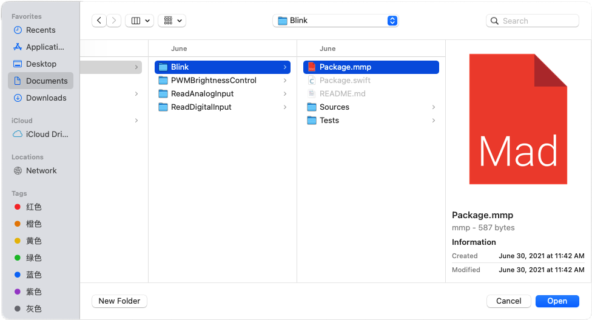
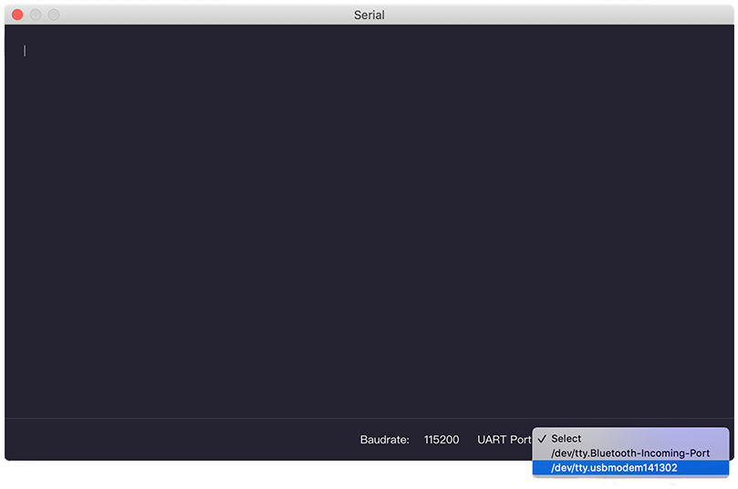

# How to use IDE

Now I will show you a brief introduction to MadMachine IDE. It allows you to edit, build the code and download it to your board. It simplifies the whole coding process, and thus everyone can get started easily.

## Open the MadMachine IDE

To enter the main interface of the MadMachine IDE, you have two choices: create a new project or open an existing one. 

### Create new project

When you first open the IDE, it will appear as follows. You need to click on **Create a new MadMachine project**. 

Then complete the project info.

- The **Project name** is necessary for your project.
- Just keep the location as it is. The project folder is in the directory `Documents/MadMachine/Projects` by default. 
- The Project Type decides whether you create an executable project or would like to write a library. 
- The **Board Type** is used to select the right board you deal with. 

Click **Create**.

### Open an existing project

When you double click the MadMachine IDE, you can see the option **Open an existing project**. 

Then a pop up window will allow you to select a project. You need to click the file `package.mmp` to open a project.

Of course, you can directly go to the directory of a project in your computer and double click the file `package.mmp` to open it.

## IDE overview

Just like many other software, there are some menus at the top to set its features.

- MadMachine: know about the IDE version, adjust the theme and font size.
- File: create, open and save the file or project.
- Edit: modify your code using some basic operations,  such as paste, copy, etc.
- Window: choose the window setup you prefer.
- Help: consult the website for more detailed information.

Now let's navigate around the interface to get familiar with IDE.

- **1 New file**: create a new file for the current project.
- **2 Save all**: save all files in the current project.
- **3 Build**: save the file and build the code you have written.
- **4 Download**: build the code and then download it to your board. If you 
- **5 Serial monitor**: send serial data from your computer to the board and receive messages from the board. 
- **6 Explorer**: find, open and manage the file you have created for current project.
- **7 Examples**: see some built-in example codes for your reference.
- **8 Editor**: write, edit and modify code. After modification, a small dot will appear next to the file name and it will disappear after you save the file.
- **9 Status bar**: confirm the connection of your board with the computer.
- **10 Terminal**: displays the output info about the building process. You can correct your code according to the messages if something goes wrong.

**About Serial monitor**

After you download the code, connect the serial port to your computer with a USB cable. Wait several seconds. Then you click on the  button, a new window will pop up.

Select the UART Port of the board and click **Connect**. If you are not sure which port is the right one, you can disconnect your board and see which one disppears.

If you cannot the port, please close the Serial window and reopen it after a few seconds. After well connected, the information will begin to appear.

The serial monitor is of great use when there is something wrong with your code. You could print the results of each step to debug your code.

