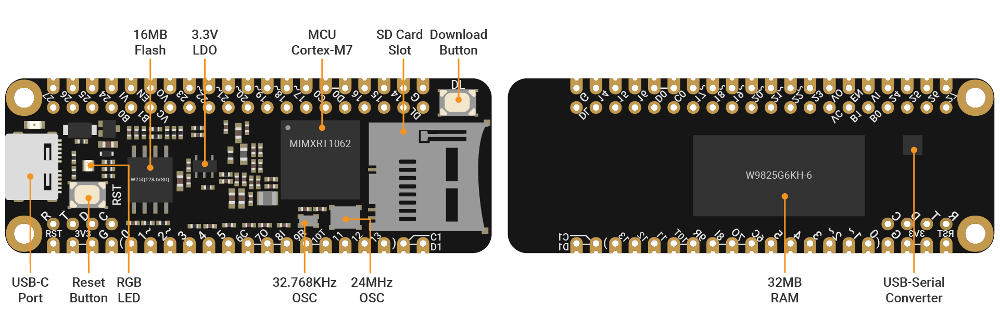
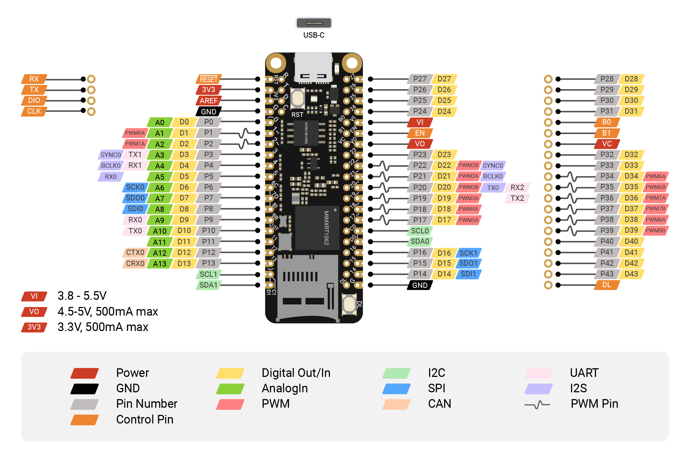

# SwiftIO Micro

SwiftIO Micro is our flagship microcontroller board designed specifically for Swift hardware programming. It is ideal for embedding into your projects, offering a perfect balance between size and power.

Despite its compact size, SwiftIO Micro is powerful enough to tackle any project you have in mind.

It can work with the expansion board called [SwiftIO Playground](./swiftio-playground) to get you started.

:::info
BTW, this board is compatible with the [Adafruit FeatherWings](https://learn.adafruit.com/adafruit-feather/featherwings), allowing you to enhance its capabilities by adding compatible wings.
:::

## MCU

i.MX RT1062 Crossover Processor with Arm® Cortex®-M7 core @600MHz. This 32-bit MCU has 600MHz clock and thus can run extremely quickly. It serves as the brain of the board to deal with all kinds of calculations.

## Memory

32MB RAM, 16MB Flash

## Buttons

- **Reset button**: restart the code that has been downloaded to your board. Sometimes, if your code doesn't run normally, you may press it to solve the problem.
- **Download button**: allows you to mount your board as a USB drive on your computer to download code. 

## USB

a USB-C port to download your code and print values. It can also power the board. The power from it will be regulated to 3.3V.

## RGB LED
It contains red, blue and green LEDs. 

It indicates the board's status. Besides, it can also be controlled by adjusting digital levels. To turn an LED on, you set the corresponding digital level to a low voltage. Conversely, setting the digital level to high turns the LED off.

## Pins

**GND**: 2 GND pins on your board to ground the circuit.

**3V3**: 1 3V3 pin that supplies 3.3V of power to your module.

**GPIO**: 44 pins D0 to D43 which act as digital input pins to read logic values or as output pins to control other circuits.

**AnalogIn**: 14 analog pins A0 to A13 to measure analog inputs and get a raw value between 0 and 4095 (12-bit resolution).

**PWMOut**: The digital pins marked with a tilde can generate PWM waves, 14 pins in total. You can set the duty cycle to simulate different output voltages. Some pins are paired and share the same frequency, like PWM3A and PWM3B. 

**I2C**: I2C0 and I2C1. Each one contains two wires: SCL for clock signal, SDA for data transmission. You can use I2C protocol to communicate with different devices by writing and reading messages through the bus.

**SPI**: SPI0 and SPI1. It needs 4 wires: CS for device selection, SDI to receive data, SDO to send out data, SCK for clock signal. The communication speed of SPI is faster than I2C and UART.

**UART**: UART0 to UART2. Two wires are required for UART communication: TX pin is for transmission and RX is for reception. The board can communicate with other external devices through these pins or with your computer through a USB cable.

**CAN**: CAN0. It uses 2 wires to receive and send data using CAN protocol.

**I2S**: it allows you to send/receive audio signals to/from other devices. 3 wires are required for the communication: TX/RX used to send/receive data, BCLK for clock signal, SYNC for left or right channel selection.

**RESET**: restart the code when the RESET pin is set to low.

**VI**: connect to LiPo battery to power the board.

**VO**: it is internally connected to the USB port. You can use it to power other devices.

**VC**: button cell can power the RTC through the Vcoin pin when there is no power supply.

**EN**: it is used to power down your board. It can be useful when the board is embedded in other devices.

**B0/B1**: the two pins are reserved for bootloader update.

