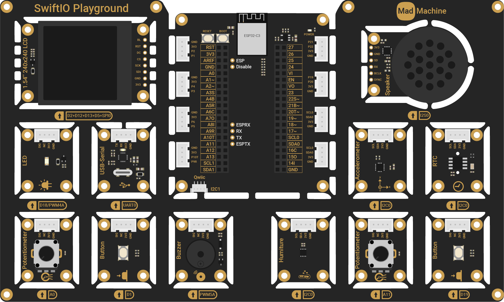
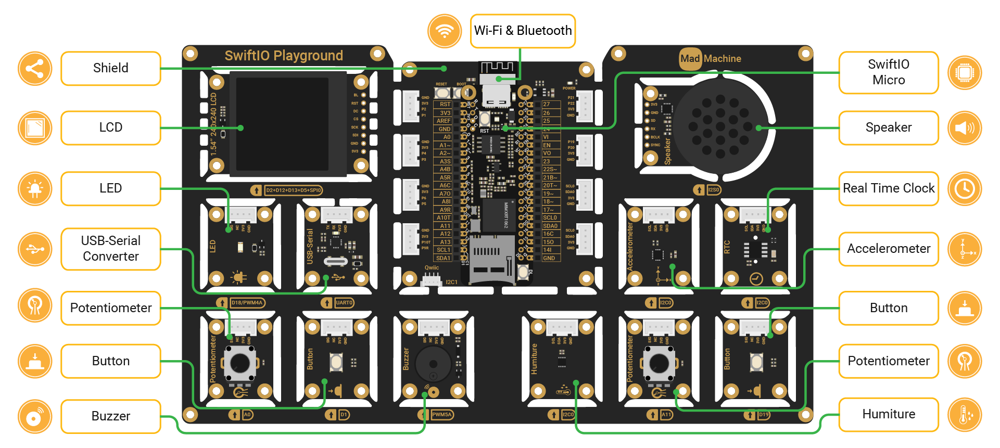

# SwiftIO Playground Kit

The SwiftIO Playground kit is the perfect user-friendly starter kit to try Swift hardware programming. It consists of two compact boards:

* **SwiftIO Micro**: main board responsible for controlling all the connected modules.

* **SwiftIO Playground**: expansion board that conveniently connects all modules to the shield positioned at its center.

With this kit, all you need to do is download the code, and the devices will spring to life instantly. It provides a hassle-free and straightforward way to get started without the need for any additional setup.

Let's look at this kit in detail:

- **SwiftIO Micro**: control all other modules.
- **Shield**: connect the SwiftIO Micro. It contains an ESP32 as a Wi-Fi module.
- **LED**: can be toggled on and off, or set to any brightness.
- **Button**: control the circuit as you press or release it. 
- **Potentiometer**: vary resistance connected in the circuit.
- **Buzzer**: produces sounds that are usually for alert or confirmation.
- **Humiture**: measure temperature and humidity.
- **Accelerometer**: detect movement by measuring the acceleration in x, y, and z-axis.
- **USB-Serial Converter**: connect the board to the USB port of another device to transmit serial data.
- **Real-Time Clock** (RTC): read the current time and date.
- **Speaker**: generate sounds or play the audio files back.
- **LCD**: display graphics and images.

With the modules included in the SwiftIO Playground kit, you can create various exciting projects. [The accompanying tutorials](../../learn/introduction) provide a step-by-step guide to cover fundamental concepts using this kit. 