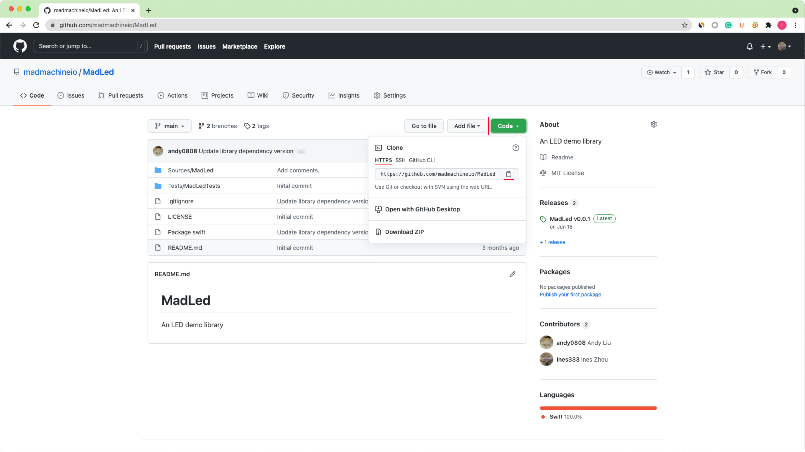
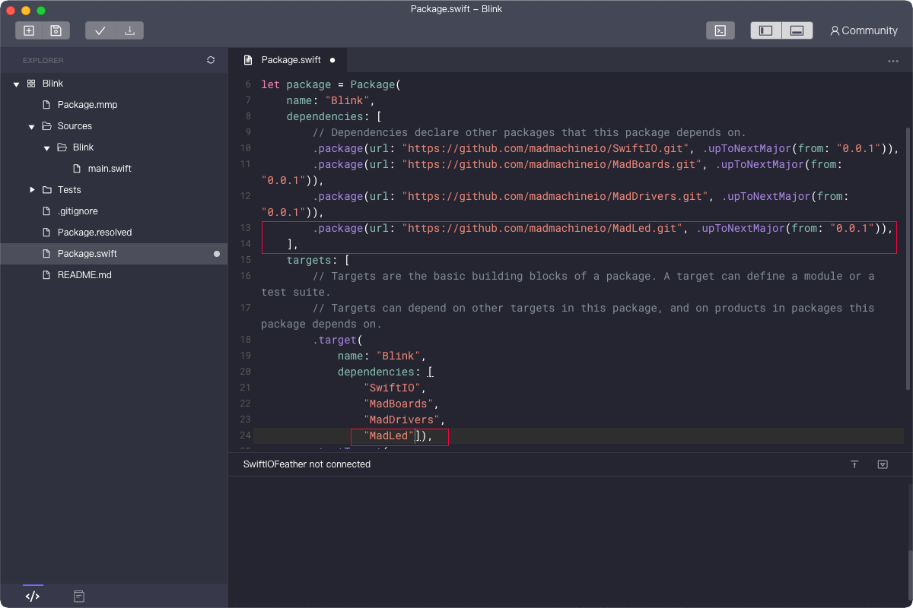

# Add a library to your project

The library usually contains a block of codes that provides specific functionalities. Then you could use it in any of your projects to realize those functionalities. Let's see how to deal with it.

:::note
Only the Mac version of MadMachine IDE supports the Swift Package Manager now. So the tutorial below is based on the Mac version. We will find ways to support the Windows version later. For the moment, you could try our CLI tool [MM SDK](use-mm-sdk.md).
:::

## How to use a library

Let's see how you could use the libraries. You will use the library `MadLed` for example.  

### Add the dependencies

At first, you need to [create a new executable project](create-new-project.md).

All our libraries are on Github. You could find the library MadLed [here](https://github.com/madmachineio/MadLed). Click the button **Code**. In the drop-down menu, click the button to **copy** the URL.

In the file `package.swift`, you indicate the **location** of the library and its **name** in `dependencies` as the two highlight parts below. Paste the URL of the package and add its version. Usually, you can keep the version as 0.0.1 to search for tags from it to the next major version since there will not be great changes.

:::note
If you use a library on your computer, for example, in the `MadMachine` folder, you can indicate its path as: `.package(path: "../../MadLed"),`
:::

### Import the target and write your code

In the file `main.swift`, import the `MadLed` just as you import `SwiftIO`. Then you could start to code.

With Swift Package Manager, you don't need to install the libraries manually. It's so convenient.

As you build your project, the file `Package.swift` will be built first, then the IDE will automatically get the libraries from the specified location. So it will cost a while when you first build it.
