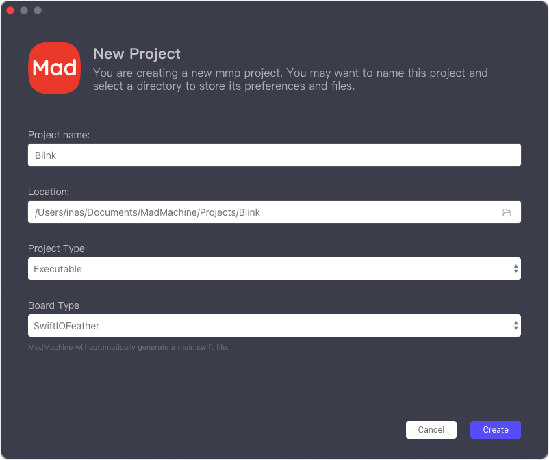

# Create a new project

When you open the IDE, it will appear as follows. You need to click on **Create a new MadMachine project**. The right pane will display the projects you created or opened.

Then complete the project info.

- The **Project name** is necessary for your project.
- Keep the location as it is. The project folder is in the directory `Documents/MadMachine/Projects` by default. 
- The **Project Type** decides whether you create an executable project or would like to write a library. Usually, you'll keep it as an executable that allows the project to run on your board.
- The **Board Type** is used to select the right board you are going to use.

Click **Create**.

And now, you are ready to write your own project.

