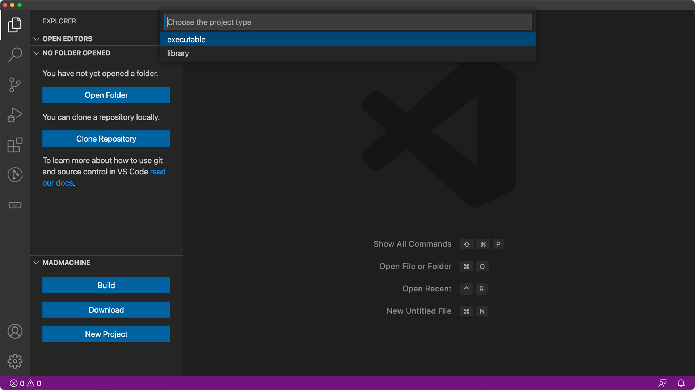
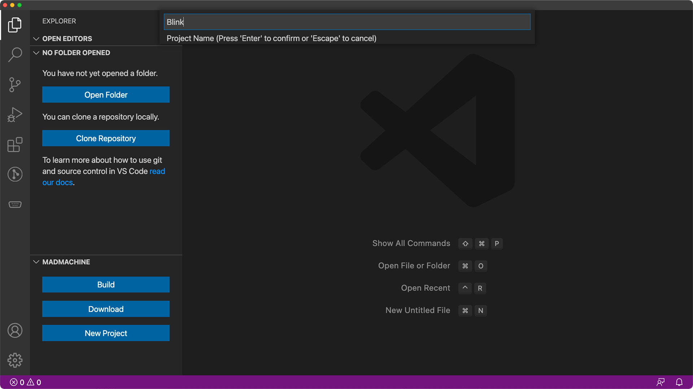

# Create a new project

1. Click the **Explorer** icon on VS Code. Click **MadMachine** on the botton and then click **New Project**. 

2. Choose the **project type**. It decides whether you create an executable project or would like to write a library. Usually, you'll choose executable to allow the project to run on your board.

3. Select the **board** for your project. 

4. Decide the **project name**. Press the **Enter** key.

5. Choose a **directory** to store the project and click **Open**.

The new project will appear in a new window. And now, you are ready to write code for your own project.
