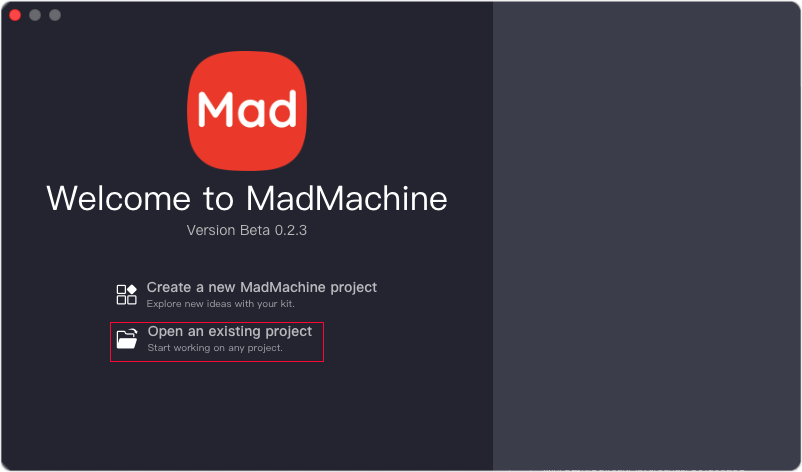
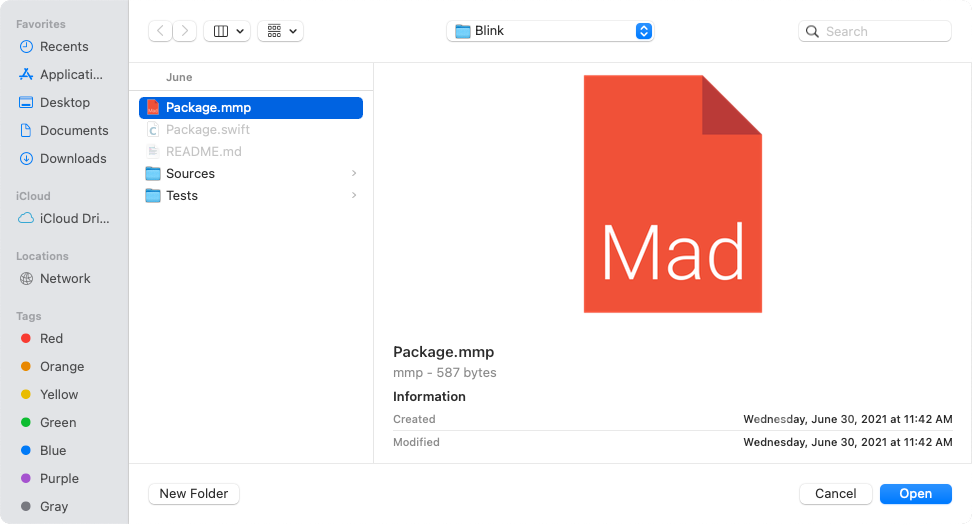
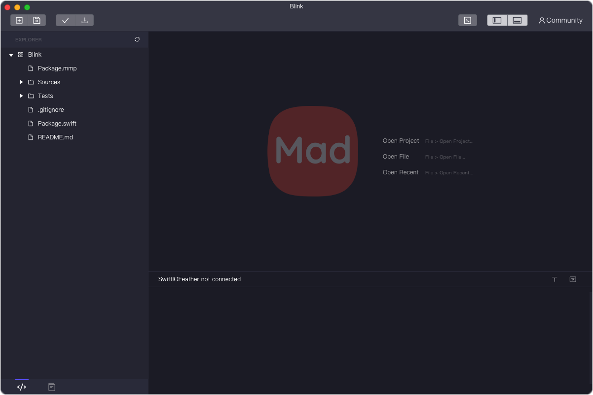

# Open an existing project

In the beginning, you will always need to learn from some good projects and then develop yours. After you download the project to your computer, you will run the demo at first. So let's see how you can open a project.

Double click the MadMachine IDE to open it. You can see the option **Open an existing project**. 

Click on it. Then a popup window will allow you to select a project. You need to choose the file `package.mmp` in the folder to open the project. 

And voila!

Of course, you can directly go to the directory where the project is on your computer. Double click the file `package.mmp` to open it.

