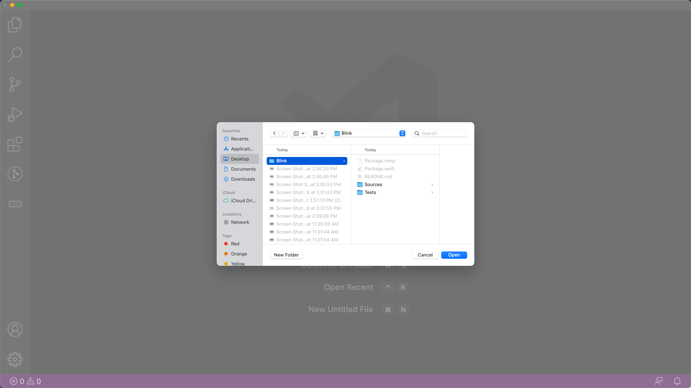

# Open an existing project

In the beginning, you will always need to learn from some good projects and then develop yours. After you download the project to your computer, you will run the demo at first. So let's see how you can open a project.

1. In the Visual Studio Code, select **File** / **Open Folder**.

2. Choose the **project folder** on your computer and click **Open**.

And voila!

