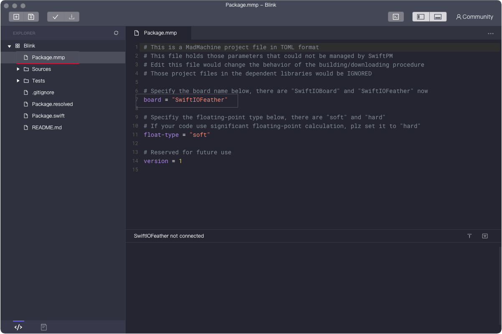
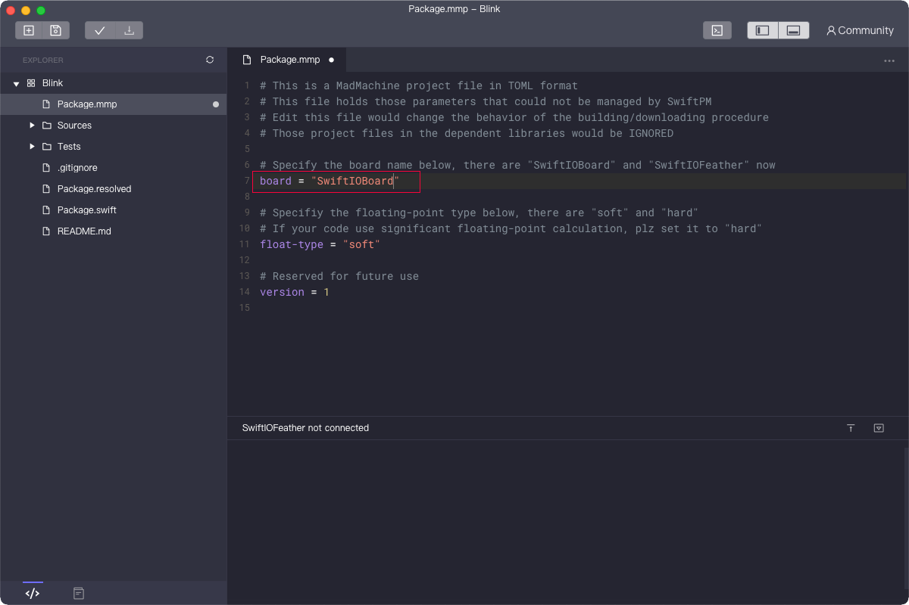

# Select a board for your project

## Choose when creating a new project

When you create a new project, you can choose the board you would like to use.

Open the MadMachine IDE, click **Create a new MadMachine project**.

At first, you will name the project. Then you select the **Board Type**. 

In the dropdown menu, you can find two boards now. Choose the one you are using. 

After creating a project, you can notice the message on the status bar that matches the board.

## Change the board for an existing project

Do you want to change the board in some of your projects? OK, no problem.

You can do that in the file `Package.swift`. Change the board type and click the save button. For example, you will change board from SwiftIOFeather to SwiftIOBoard.

When the file is saved, the message in the status bar will change accordingly.

