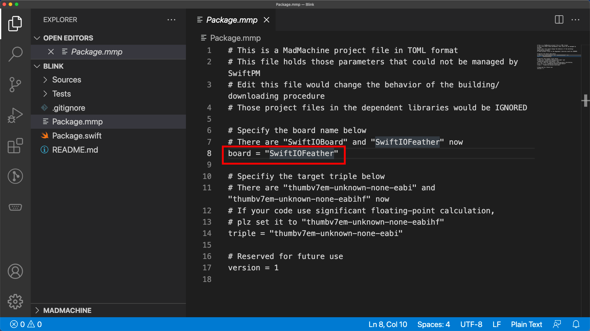

# Select a board for your project

### Choose when creating a new project

When you create a new project, you can choose the board you would like to use. You can go to [this tutorial](create-new-project) to see how you create a new project.

### Change the board for an existing project

If the example projects use a different board, you can change it to make projects run on your board.

In the file `Package.mmp`, change the board type and save the file. 

