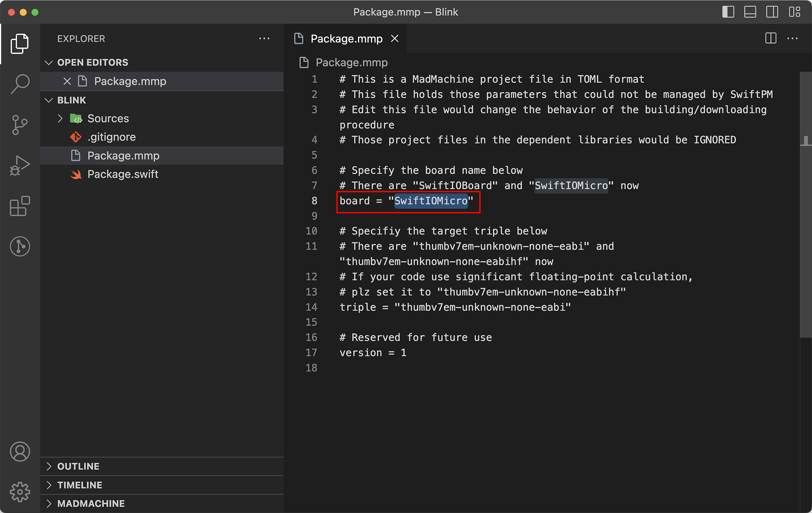

# Changing board type

When you create a new project, you need to choose the board you would like to use. You can go to [this tutorial](../getting-started/create-project) to see how you create a new project.

After a project is created, the board type is chosen. However, you can still change it. It's quite simple. 

In the file `Package.mmp`, change the board type as below and save the file. 

In this way, if some example projects use a different type of board, you can change it to make the projects run on your board.