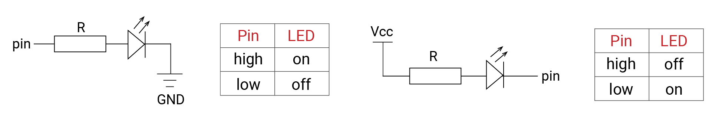
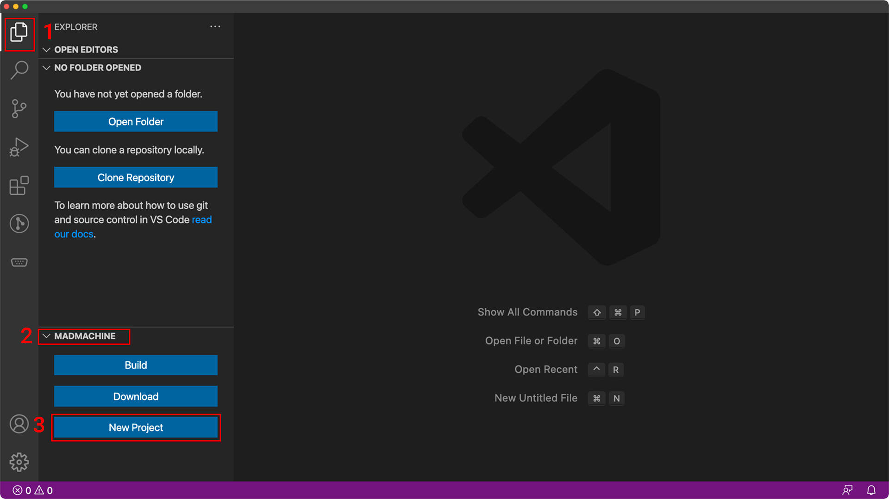
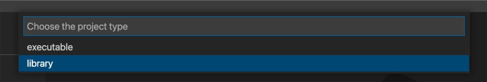
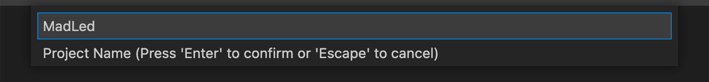
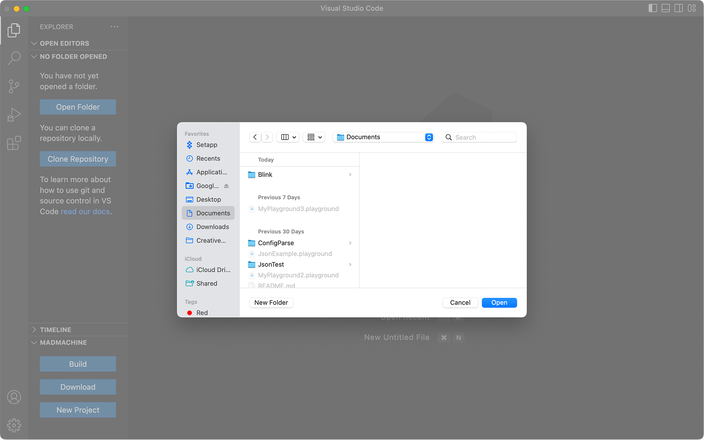
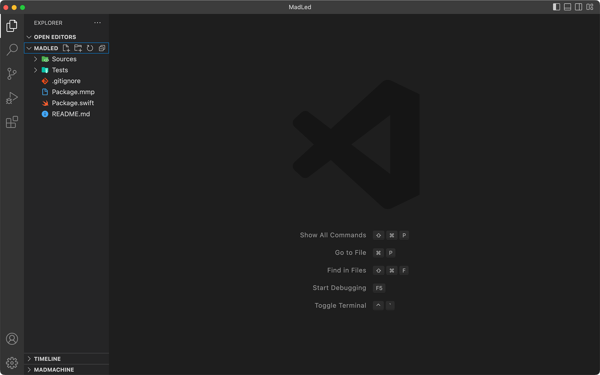

# Creating a library

Let's learn how to write a custom library in this tutorial. You will create a simple library to control an LED.

The LEDs sometimes need a high voltage to be on, sometimes low voltage. It's so confusing. Why not write a library to make it easier?

## Before start
Let's find out why there are different situations to light the LED.

It depends on how the LED is connected to your circuit. There are two ways to connect the LED:

- In the first circuit, the LED is connected to the digital pin and ground. Since the current always flows from high to low voltage, if the pin outputs a high voltage, the current flows from the pin to the ground, and the LED will be on. If it outputs a low voltage, there is no current and the LED is off.

- In the second circuit, the LED is connected to the power and a digital pin. If the pin outputs a high voltage, there is no voltage difference between the two ends of the LED, so the LED is off. When the pin outputs a low voltage, the current can flow from the power to the pin, and the LED will be on. The onboard LED works in this way.



## Create a new project
Let's start to write the library. 

1. In the Explorer, click **MADMACHINE** / **New Project** to create a new project.



2. Choose **Library** as the project type. You can notice two options: an executable is a program that could run on your board; a library provides some functionalities and can be imported to other projects.



3. Choose a **name** for your libary.



4. Choose a **location** to save it.



Well, the project is ready. 



Let's look at the file `Package.swift`. It defines your project name and the dependencies. It is created automatically when creating a Swift project. 

Here is a quick overview:

- One project is a swift **package**. Its name is `MadLed` in this case (line 5). 
- The package has **products** that could be either executables or libraries. In this case, it has a library as its product. It shares the same name `MadLed` (line 9).
- A library could have one or more **targets**. What you import in other projects is the target. Here it has only one target with the same name `MadLed` (line 10).
- Then it's the location of the **dependencies**. It needs only the `SwiftIO` library (line 14, 21).


```swift title="Package.swift" showLineNumbers {5,9-10,14,21}
// swift-tools-version:5.7
// The swift-tools-version declares the minimum version of Swift required to build this package.
import PackageDescription
let package = Package(
    name: "MadLed",
    products: [
        // Products define the executables and libraries a package produces, and make them visible to other packages.
        .library(
            name: "MadLed",
            targets: ["MadLed"]),
    ],
    dependencies: [
        // Dependencies declare other packages that this package depends on.
        .package(url: "https://github.com/madmachineio/SwiftIO.git", branch: "main"),
    ],
    targets: [
        // Targets are the basic building blocks of a package. A target can define a module or a test suite.
        // Targets can depend on other targets in this package, and on products in packages this package depends on.
        .target(
            name: "MadLed",
            dependencies: ["SwiftIO"]),
        .testTarget(
            name: "MadLedTests",
            dependencies: ["MadLed"]),
    ]
)
```

## Write code

Let's come to the code. Open the file `MadLed.swift` in folder `Sources/MadLed`.

- The first step is, as usual, to **import** the `SwiftIO`.

- All your libraries related to the hardware need to use **class**. All struct instances are passed by value, and class instances are passed by reference. The corresponding hardware is unique. When you change any of the instances, the hardware needs to change accordingly. If a struct is used, one of its instances is changed, and others remain unchanged, which will cause confusion. So the class is used here.

- This class is declared to be **final**. So it cannot be inherited by other classes.

- You could notice the keyword **`public`** and **`private`** in the code. They decide the access control of your class. `public` means any other parts can use it. The class, initializer, and methods will be used elsewhere, so they are public. `private` means it can only be used inside the class. The properties `pin` and `ledOnValue` are used only inside the class, so they are private.

- To light a LED, you must initialize a digital pin. So you declare a **property** `pin` to be `DigitalOut`. Then the property `ledOnValue` is used to store the digital value to turn on the LED, `true` or `false`. For example, if you use the onboard LED, this value will be `false`.

- The two properties above don't have default values since they will change according to your circuit. Thus you will need an **initializer**. It takes two parameters, which correspond respectively to the properties. They share the same name, so `self` is used to identify them. `self.pin` refers to the property `pin` of the class. When you pass values to the parameters, the value will be assigned respectively to the two properties of the class. 

- After the initializer, you need to create some **methods** to control the LED. Let's have a look at the method `on()`. Since the `ledOnValue` defines the value to turn on a LED and has been set in the initializer, you can directly pass its value to the method `write()` to turn on an LED.

- The rest methods are similar. They set the output on the specified pin base on `ledOnValue`.

```swift title="MadLed.swift" showLineNumbers
import SwiftIO

final public class MadLed {

    private let pin: DigitalOut
    private let ledOnValue: Bool

    // Initilize the LED.
    public init(_ pin: DigitalOut, ledOnValue: Bool) {
        self.pin = pin
        self.ledOnValue = ledOnValue
    }

    // Turn on the LED.
    public func on() {
        pin.write(ledOnValue)
    }

    // Turn off the LED.
    public func off() {
        pin.write(!ledOnValue)
    }

    public func toggle() {
        let currentValue = pin.getValue()
        pin.write(!currentValue)
    }
}
```

Well, that's a brief introduction about how to create a basic library to control the LED. You can find its code [here](https://github.com/madmachineio/MadLed). Then you can [use it in your project](./use-library).

