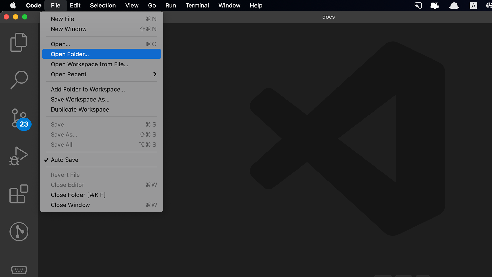
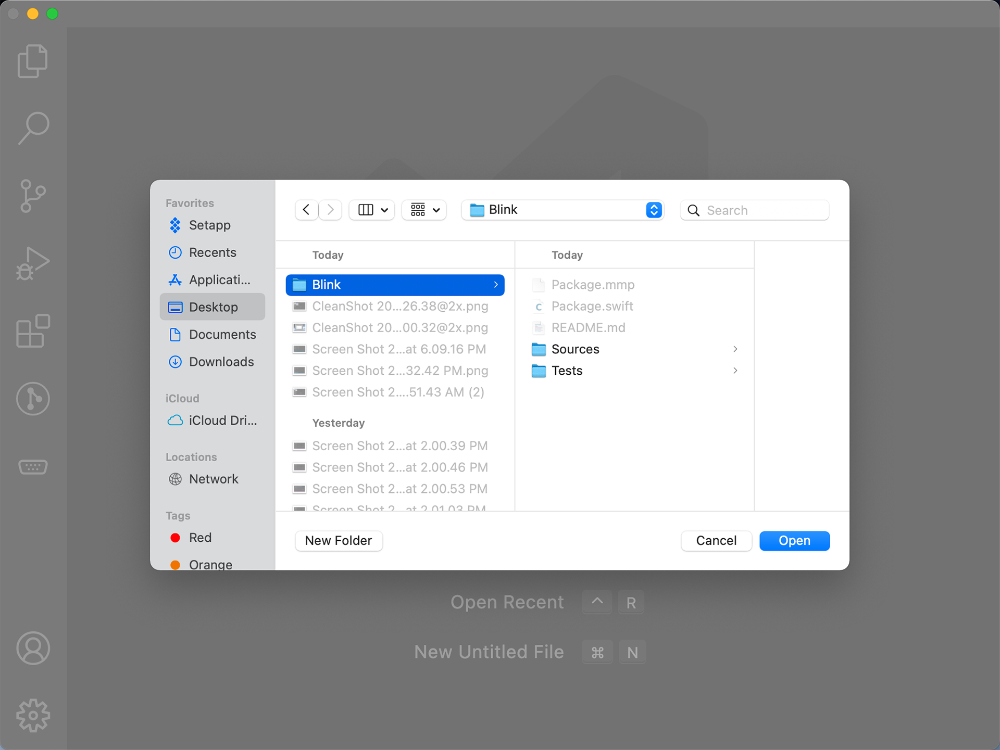
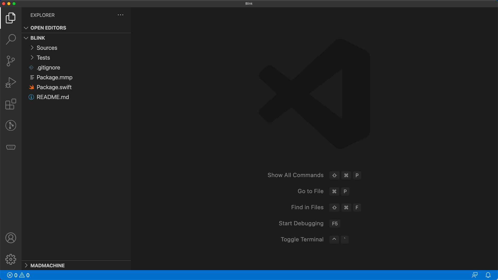

# Running an example project

In the beginning, you will always need to learn from some projects and then develop yours. [Here](https://github.com/madmachineio/MadExamples) are some projects for your reference. After you download the projects to your computer, you would run the demo at first. So let's see how you open a project.

1. In the Visual Studio Code, select **File** / **Open Folder**.

2. Choose the **project folder** on your computer and click **Open**.

And voila!

To build and download the project, you can follow [this guide](../getting-started/download).