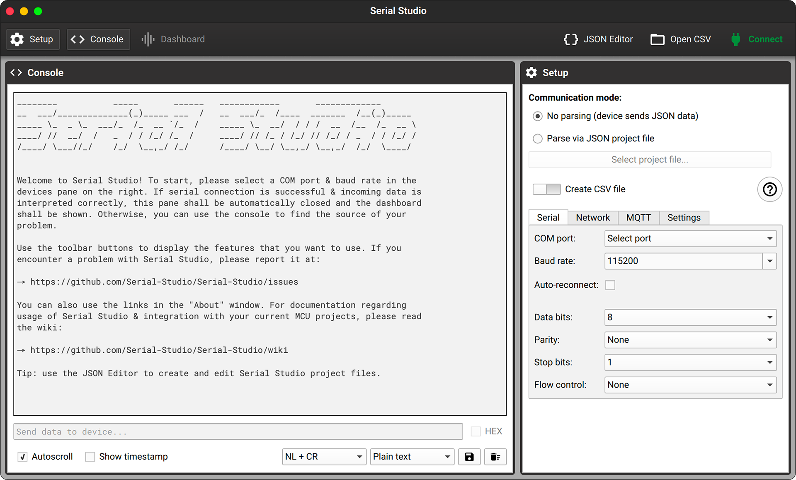

# Serial and debugging

You must have met similar situations: your code is downloaded to the board but doesn't work as you have predicted; even if you press the reset button, the board is still unresponsive. You are unable to see what is happening inside your device, so at that time, you need to debug your code.

There are two common ways. One is to step through it, which is not supported yet. So the best way now is to print the information out to find the problem.

## Step 1: Install and open your serial tool

If you don't have a serial tool on your computer, you could download the [Serial Studio](https://serial-studio.github.io/) according to your operating system. Then unzip and install it.

    
 Solution: A popup says that Serial Studio cannot be opened because the developer cannot be verified. 

1. Click **Cancel**.

2. Click  / **System Preferences**.

3. Click **Security & Privacy**.

4. Click **Open Anyway**.

5. Click **Open**.

And that's it.

## Step 2: Add `print()` in your code

Add the function `print()` to print all values out in case of any unexpected mistakes. There are so many possibilities. Only in this way do you know which step goes wrong.

After finishing the code, download the code to your board.

## Step 3: Connect the board to your computer

Now connect the board to your computer through the serial port. If you are not sure which is the correct one, check the [introduction of your board here](../hardware/overview).

It's for serial communication between your board and computer. The microcontrollers use serial communication, but your computer hardly uses it, so a serial to USB converter is added to the board to allow data transmission. 

## Step 4: Set your software

1. Choose the correct port for your board. The port name may be different. If you are not sure which port, you could disconnect your board and see which one disappears. 

2. Make sure the baud rate is **115200**. Choose **NL + CR** for newline and carriage return. And choose **Plain text** instead of Hexadecimal for better understanding.

3. Click **Connect**.

Once connected, the Connect button will change to Disconnect.

## Step 5: View values

Press the reset button on your board to restart the code. When the code runs again, you can check the values on the output window. According to the printed values, you can infer which line of code is not executed or has an error by mistake. 