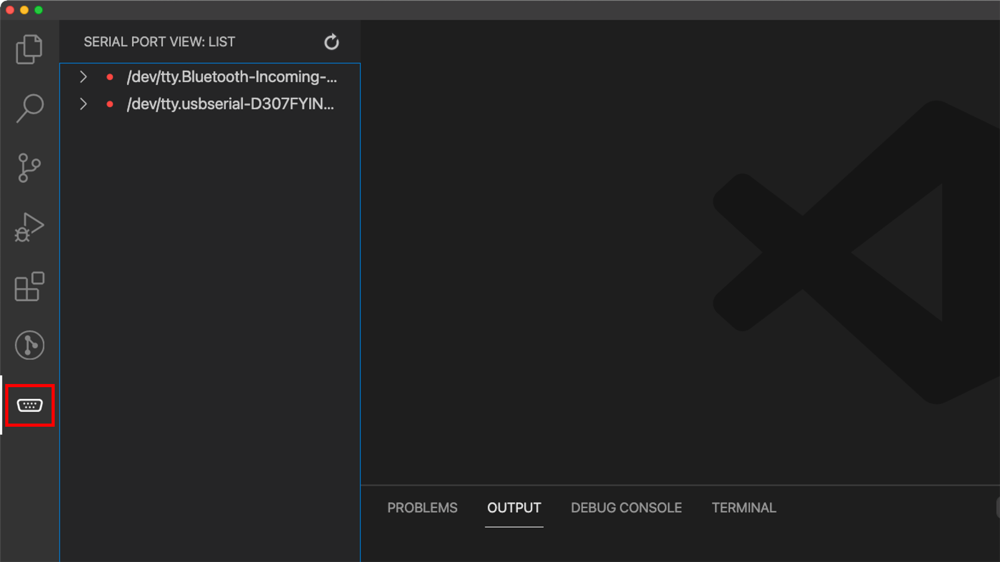
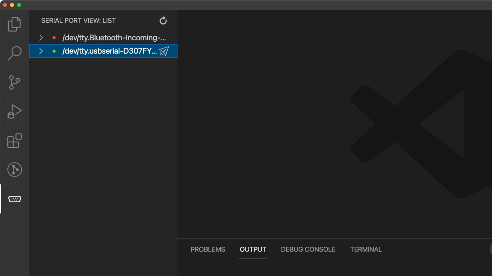
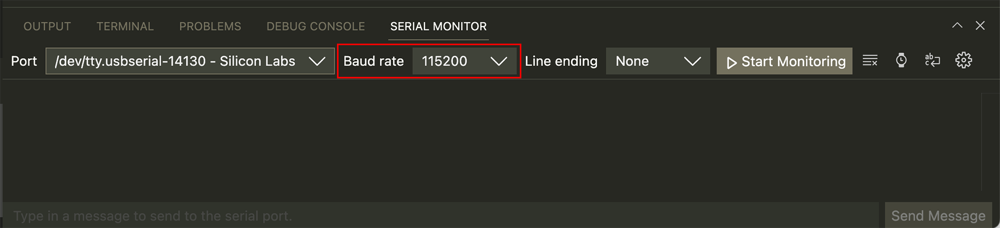

# Serial and debugging

You must have met similar situations: your code is downloaded to the board but doesn't work as you have predicted. Even if you press the reset button, the board is still unresponsive. You are unable to see what is happening inside your device. At that time, you need to debug your code.

There are two common ways. One is to step through it, which is not supported yet. So the best way by now is to print the information out to find the problem.

## Step 1: Add `print()` in your code
Add the function `print()` to print all values out in case of any unexpected mistakes. There are so many possibilities. Only in this way you know which step goes wrong.

After finishing the code, download the code to your board.

## Step 2: Connect the board to the computer through the serial port
Now change the USB connection from the download port to the serial port. The Serial port is for serial communication between your board and computer. 

The microcontrollers use serial communication, but your computer hardly uses it, so a serial to USB converter is added to the board to allow the data transmission between them. 

SwiftIO Feather is a simplified version and doesn't have a serial port, but you can find a compatible shield with the port. SwiftIO board has two ports, so make sure you connect the serial port.

## Step 3: Open serial monitor

1. The serial extension is on the left bar. Click on the icon, and you will see the available ports. There is a small red dot before each port, which means the ports are not connected.

2. Click the port for your board. You would notice the red dot turns green, and the port is connected successfully. If you are not sure which port, you can disconnect your board and see which one disappears.

3. Unfold the port menu. Click the **Baud Rate** and set it to 115200. Click the **View Mode** to change it to String Mode.

## Step 4: Find the problem

Press the reset button on your board to restart the code. When the code runs again, you can see the values on the output window. According to the printed values, you can see which line of code is not executed or has an error by mistake. 