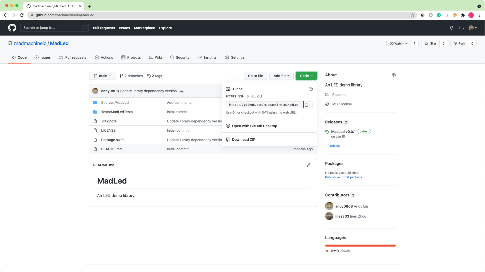
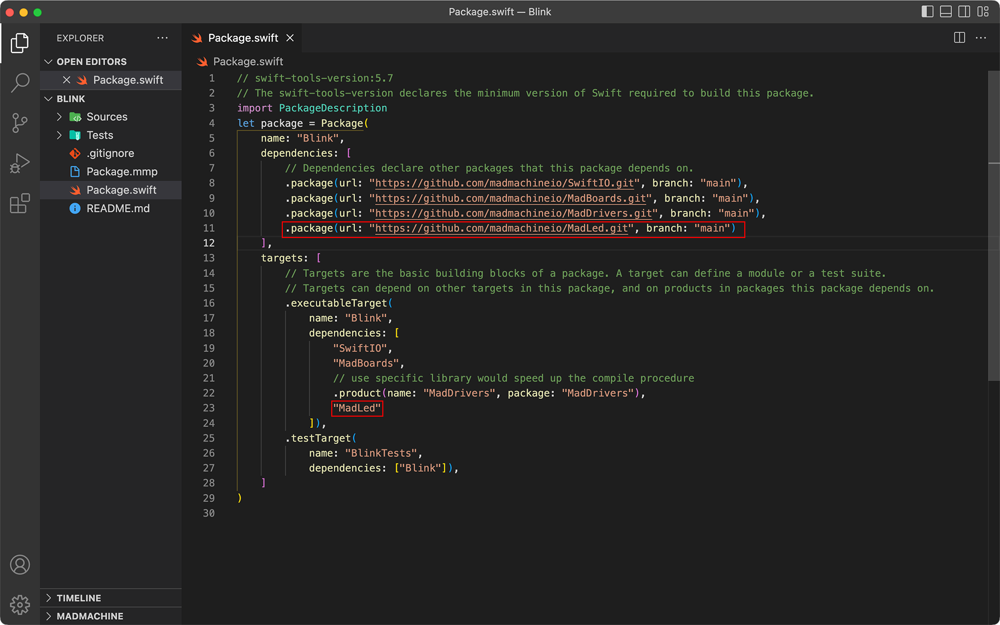

# Using a library

Let's see how you could use the libraries. You will use the library `MadLed` for example.  

## Add the dependencies

1. At first, you need to [create a new executable project](../getting-started/create-project).

2. All our libraries are on Github. Open to the repository [`MadLed`](https://github.com/madmachineio/MadLed). Click the button **Code**. In the drop-down menu, click the button to **copy the URL**.



In the file `package.swift`, you indicate the **location** of the library and its **name** in `dependencies` as below. Paste the URL of the package and add its version. You will use the version on the `main` branch.

:::info
To use a local library on your computer, the dependency is: `.package(path: "..."),` (... is the directory of the library on the computer).
:::

```swift title="Package.swift" showLineNumbers
// swift-tools-version:5.7
// The swift-tools-version declares the minimum version of Swift required to build this package.
import PackageDescription
let package = Package(
    name: "Blink",
    dependencies: [
        // Dependencies declare other packages that this package depends on.
        .package(url: "https://github.com/madmachineio/SwiftIO.git", branch: "main"),
        .package(url: "https://github.com/madmachineio/MadBoards.git", branch: "main"),
        .package(url: "https://github.com/madmachineio/MadDrivers.git", branch: "main"),
        // highlight-next-line
        .package(url: "https://github.com/madmachineio/MadLed.git", branch: "main")
    ],
    targets: [
        // Targets are the basic building blocks of a package. A target can define a module or a test suite.
        // Targets can depend on other targets in this package, and on products in packages this package depends on.
        .executableTarget(
            name: "Blink",
            dependencies: [
                "SwiftIO",
                "MadBoards",
                // use specific library would speed up the compile procedure
                .product(name: "MadDrivers", package: "MadDrivers"),
                // highlight-next-line
                "MadLed"
            ]),
        .testTarget(
            name: "BlinkTests",
            dependencies: ["Blink"]),
    ]
)
```




## Import the target and write code

In the file `Blink.swift`, import the `MadLed` just as you import `SwiftIO`. Then you can control LEDs more easily using the functions provided in the library.

```swift title="Blink.swift" showLineNumbers
import SwiftIO
import MadBoard
import MadLed

@main
public struct Blink {
    public static func main() {
        let redPin = DigitalOut(Id.RED)
        let bluePin = DigitalOut(Id.BLUE)

        let redLed = MadLed(redPin, ledOnValue: false)
        let blueLed = MadLed(bluePin, ledOnValue: false)

        blueLed.off()
        redLed.on()
        sleep(ms: 1000)
        redLed.off()

        while true {
            blueLed.toggle()
            sleep(ms: 1000)
        }
    }
}
```

With Swift Package Manager, you can use online repositories and don't need to install the libraries manually.

As you build your project, the file `Package.swift` will be built first and will automatically get the libraries from the specified location. So it will cost a while when you build your project for the first time.
