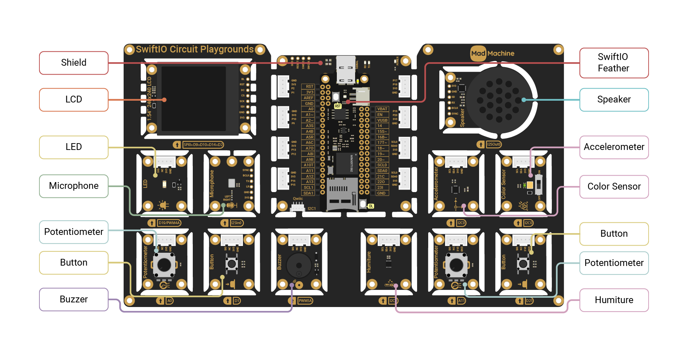

# SwiftIO Circuit Playgrounds

SwiftIO Circuit Playgrounds is a super easy-to-use starter kit for you. It is an all-in-one board with all modules connected to the shield in the middle. You don't even need to build any circuit. Just download the code and the devices will work immediately if there's no error.

Let's look at these modules in detail:

- **SwiftIO Feather board**: control all other modules.
- **Shield**: allow the SwiftIO Feather board to connect to the whole board.
- **LED**: can be toggled on and off, or set to any brightness.
- **Button**: control the circuit as you press or release it. 
- **Potentiometer**: vary resistance connected in the circuit.
- **Buzzer**: produces sounds that are usually for alert or confirmation.
- **Humiture**: measure temperature and humidity.
- **Color sensor**: detect the color of an object and the light intensity.
- **Accelerometer**: detect movement by measuring the acceleration in x, y, and z-axis.
- **Speaker**: generate sounds or play the audio files back.
- **Microphone**: record sound and store audio data.
- **LCD**: display graphics or images.

This kit contains several commonly used modules. You can create plenty of projects with it. The material [Learning A-Z](../../learn/introduction) is based on it and guides you from the most basic concept.
