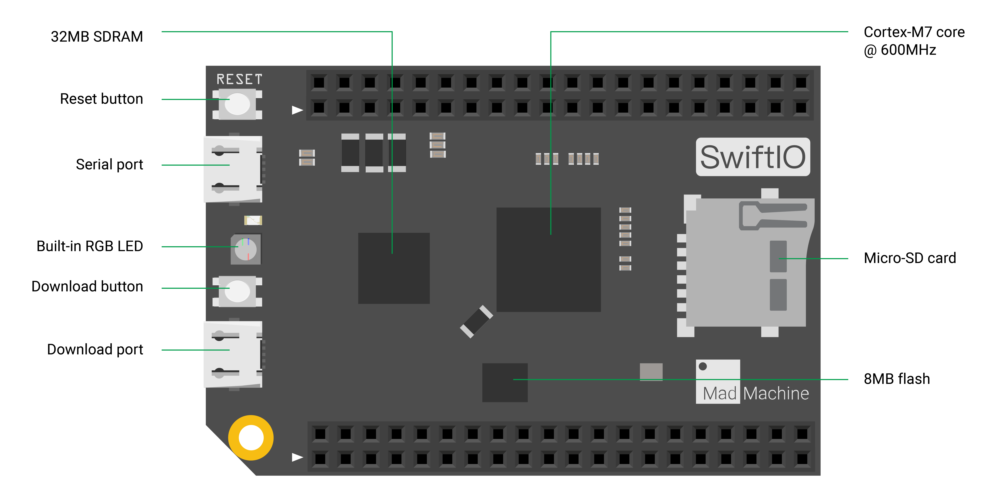

# SwiftIO Board

SwiftIO board is our first board that runs Swift language. It is powerful enough and fully functional for most of your projects.

Let's look at parts of the SwiftIO board.

## MCU

i.MX RT1052 Crossover Processor with Arm® Cortex®-M7 core @600MHz. This 32-bit MCU has 600MHz clock and thus can run extremely quickly. It serves as the brain of the SwiftIO board to deal with all kinds of calculations.

## Memory

The SwiftIO board has 8MB external flash, 32MB SDRAM.

## Buttons

You can see 2 buttons on the SwiftIO board. 
- The **download button** allows you to mount your board as a USB drive on your computer in order to download code. 
- The **reset button** can restart the code that has been downloaded to your board. Sometimes, if your code doesn't run correctly, you may press it to solve the problem.

## Micro USB

There are 2 USB ports, one for serial communication and one for code downloading. Both of them can be power your board.

- You need to connect the **Download port** on the SwiftIO board to your computer to download your code.

- You can print the values and see them in the serial monitor by connecting the **Serial port** since there is a UART to USB converter on the board.

 

## Built-in RGB LED
It contains red, blue and green LEDs. You can know from it the status of your board. Besides, you can control them by setting digital levels. 

| LED State | RED | GREEN | BLUE |
| :--- | :--- | :--- | :--- |
| On | USB communication failed | USB connection established | - |
| Slow flashing | Fail to verify file `swiftio.bin` | - | - |
| Fast flashing | Fail to open file `swiftio.bin` | Detecting USB connection | Detecting SD card |

:::note
When you apply a low voltage, the built-in LEDs will be on. When you apply a high voltage, they will be off.

:::

## Pins

**GND**: there are 8 GND (ground) pins on your board to ground the circuit.

**3V3**: there are 4 3V3 pins that supply 3.3V of power to your module.

**DigitalIn/Out**: The digital pins are labeled D0 to D45 on the SwiftIO board. These pins can act as digital input pins to read logic values or as output pins to control other circuits.

**AnalogIn**: SwiftIO board has 12 analog pins from A0 to A11. You can use them to measure analog inputs and get a raw value between 0 and 4095 (12-bit resolution).

**PWMOut**: the digital pins marked with a tilde can generate PWM waves, 14 pins in total. You can set the duty cycle to simulate different output voltages. Some of the pins are paired and share the same frequency, like PWM3A and PWM3B. 

**I2C**: I2C0 and I2C1. Each one contains two wires: SCL for clock signal, SDA for data transmission. You can use I2C protocol to communicate with different devices by writing and reading messages through the bus.

**SPI**: SPI0 and SPI1. It needs 4 wires: CS for device selection, SDI to receive data, SDO to send out data, SCK for clock signal. The communication speed of SPI is faster than I2C and UART.

**UART**: UART0 to UART3. Two wires are required for UART communication: TX pin is for transmission and RX is for reception. The board can communicate with other external devices through these pins or with your computer through a USB cable.

**CAN**: CAN0 and CAN1. It uses 2 wires to receive and send data using CAN protocol.

**I2SIn**: it allows you to receive audio signals from other devices. You can see it needs 3 wires: RX is to receive data, BCLK carries clock signal, SYNC for left or right channel selection.

**I2SOut**: it allows you to send audio signals to other devices. It needs 3 wires: TX is to send data, BCLK carries clock signal, SYNC for left or right channel selection.

**RESET**: restart the code when the RESET pin is set to low.

**Vin**: you can supply voltage to the board using an external power source through Vin pin. You'd better apply voltages between 5V to 12V.

**Vout**: the Vout pin will provide the higher output voltage between Vcc and  USB voltage.

**Vcoin**: button cell can power the RTC through the Vcoin pin when there is no power supply.

**IOREF**: this pin provides a voltage corresponding to the input and output of that board,  that's to say 3.3V.

## By the way

All these details may sound quite confusing at first. Don't worry, most of them are not commonly used. 

If you have not idea how to start, you can work with [SwiftIO Maker kit](./maker-kit) to learn with some simple projects. 