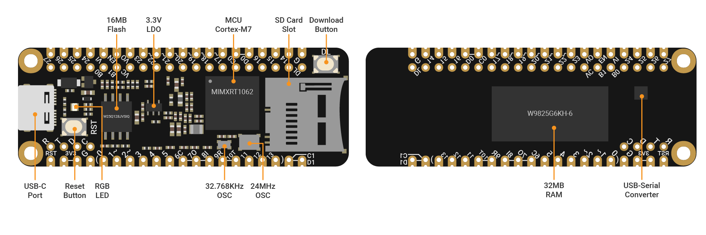
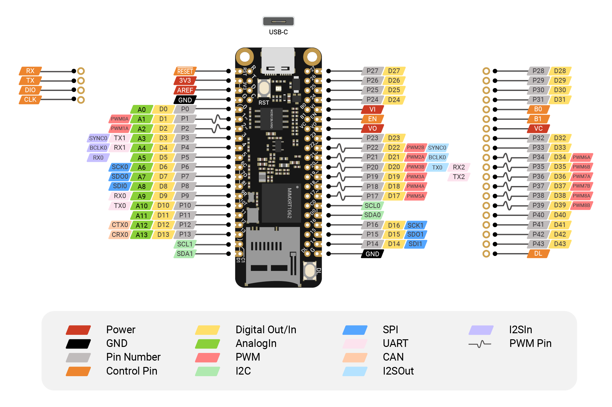

# SwiftIO Feather board

SwiftIO Feather is a simplified version of the SwiftIO board. Though small in size, it is powerful enough for all projects. One of its advantages is that it is suitable to be embedded in any of your projects.

The SwiftIO feather is compatible with the Adafruit feather system. This means you can use it together with the hardware in this system. There are so many possibilities! 

 

## MCU

i.MX RT1062 Crossover Processor with Arm® Cortex®-M7 core @600MHz. This 32-bit MCU has 600MHz clock and thus can run extremely quickly. It serves as the brain of the SwiftIO board to deal with all kinds of calculations.

## Memory

It has 8MB flash, 32MB SDRAM.

## Buttons

- The **download button** allows you to mount your board as a USB drive on your computer in order to download code. 
- The **reset button** can restart the code that has been downloaded to your board. Sometimes, if your code don't run normally, you may press it to solve the problem.

## USB

It has a USB-C port that allows you to download your code. It can also power the board. The power from it will be regulated to 3.3V.

## LiPo battery connector

If you want to use the SwiftIO Feather board in your DIY project, you can power it with a LiPo battery.
 

## Built-in RGB LED
It contains red, blue and green LEDs. You can know from it the status of your board. Besides, you can control them by setting digital levels. 

| LED State | RED | GREEN | BLUE |
| :--- | :--- | :--- | :--- |
| On | USB communication failed | USB connection established | - |
| Slow flashing | Fail to verify file `feather.bin` | - | - |
| Fast flashing | Fail to open file `feather.bin` | Detecting USB connection | Detecting SD card |

:::note
When you apply a low voltage, the built-in LEDs will be on. When you apply a high voltage, they will be off.

:::

## Pins

**GND**: there are 2 GND (ground) pins on your board to ground the circuit.

**3V3**: there is a 3V3 pin that supplies 3.3V of power to your module.

**DigitalIn/Out**: The digital pins are labeled D0 to D35 on SwiftIO board. These pins can act as digital input pins to read logic values or as output pins to control other circuits.

**AnalogIn**: SwiftIO board has 12 analog pins from A0 to A13. You can use them to measure analog inputs and get a raw value between 0 and 4095 (12-bit resolution).

**PWMOut**: The digital pins marked with a tilde can generate PWM waves, 14 pins in total. You can set the duty cycle to simulate different output voltages. Some of the pins are paired and share the same frequency, like PWM3A and PWM3B. 

**I2C**: I2C0 and I2C1. Each one contains two wires: SCL for clock signal, SDA for data transmission. You can use I2C protocol to communicate with different devices by writing and reading messages through the bus.

**SPI**: SPI0 and SPI1. It needs 4 wires: CS for device selection, SDI to receive data, SDO to send out data, SCK for clock signal. The communication speed of SPI is faster than I2C and UART.

**UART**: UART0 to UART2. Two wires are required for UART communication: TX pin is for transmission and RX is for reception. The board can communicate with other external devices through these pins or with your computer through a USB cable.

**CAN**: CAN0. It uses 2 wires to receive and send data using CAN protocol.

**I2SIn**: it allows you to receive audio signals from other devices. You can see it needs 3 wires: RX is to receive data, BCLK carries clock signal, SYNC for left or right channel selection.

**I2SOut**: it allows you to send audio signals to other devices. It needs 3 wires: TX is to send data, BCLK carries clock signal, SYNC for left or right channel selection.

**RESET**: restart the code when the RESET pin is set to low.

**VBAT**: it is internally connected to the LiPo battery connector. You can use it to power other devices.

**VUSB**: it is internally connected to the USB port. You can use it to power other devices.

**Vcoin**: button cell can power the RTC through the Vcoin pin when there is no power supply.

**EN**: it is used to power down your board. It can be useful when the board is embedded in other devices.

**B0/B1**: the two pins are reserved for bootloader update.

## By the way

SwiftIO Feather board is designed to be easily fitted into any of your projects. So you can choose whether the headers on the board are pre-soldered or not.

Of course, it comes with a learning kit to get started. It's called [SwiftIO Circuit Playgrounds](./circuit-playgrounds). Now we are redesigning it and guess it will be

Besides, there will be other compatible shields for more usages in the future.