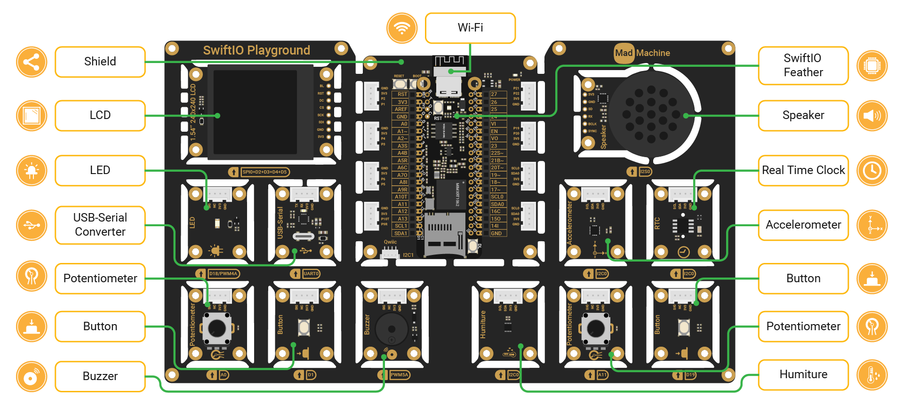

# SwiftIO Playground kit

SwiftIO Playground kit is a super easy-to-use starter kit for you. It contains an all-in-one board with all modules connected to the shield in the middle and the SwiftIO Feather board. You don't even need to build any circuit. Just download the code and the devices will work immediately if there's no error.

Let's look at these modules in detail:

- **SwiftIO Feather board**: control all other modules.
- **Shield**: connect the SwiftIO Feather board. It contains an ESP32 as a Wi-Fi module.
- **LED**: can be toggled on and off, or set to any brightness.
- **Button**: control the circuit as you press or release it. 
- **Potentiometer**: vary resistance connected in the circuit.
- **Buzzer**: produces sounds that are usually for alert or confirmation.
- **Humiture**: measure temperature and humidity.
- **Accelerometer**: detect movement by measuring the acceleration in x, y, and z-axis.
- **USB-Serial Converter**: connect the board to the USB port of another device to transmit serial data.
- **Real-Time Clock**: read the current time and date.
- **Speaker**: generate sounds or play the audio files back.
- **LCD**: display graphics or images.

This kit contains several commonly used modules. You can create plenty of projects with it. [These tutorials](../../learn/introduction) guide you through the most basic concept using this kit.
