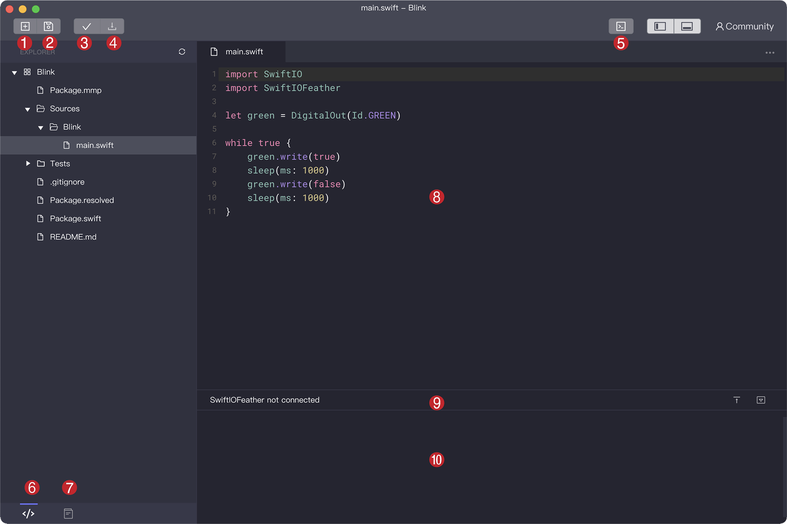

# MadMachine IDE 

Now I will show you a brief introduction to MadMachine IDE. It allows you to edit, build the code and download it to your board. It simplifies the whole coding process, and thus everyone can get started quickly.

You can get the software [here](https://github.com/madmachineio/MadMachineIDE/releases).

Just like other software, there are some menus at the top to set its features.

- MadMachine: know about the IDE version, adjust the theme and font size.
- File: create, open and save the file or project.
- Edit: modify your code using some basic operations,  such as paste, copy, etc.
- Window: choose the window setup you prefer.
- Help: consult the website for more detailed information.

Now let's navigate around the interface to get familiar with IDE.

1. **New file**: create a new file for the current project.
2. **Save all**: save all files in the current project.
3. **Build**: save the file and build the code you have written.
4. **Download**: build the code and then download it to your board. If you 
5. **Serial monitor**: send serial data from your computer to the board and receive messages from the board. 
6. **Explorer**: find, open and manage the file you have created for the current project.
7. **Examples**: see some built-in example codes for your reference.
8. **Editor**: write, edit and modify code. After modification, a small dot will appear next to the file name, and it will disappear after you save the file.
9. **Status bar**: confirm the connection of your board with the computer.
10 **Terminal**: displays the output info about the building process. You can correct your code according to the messages if something goes wrong.
