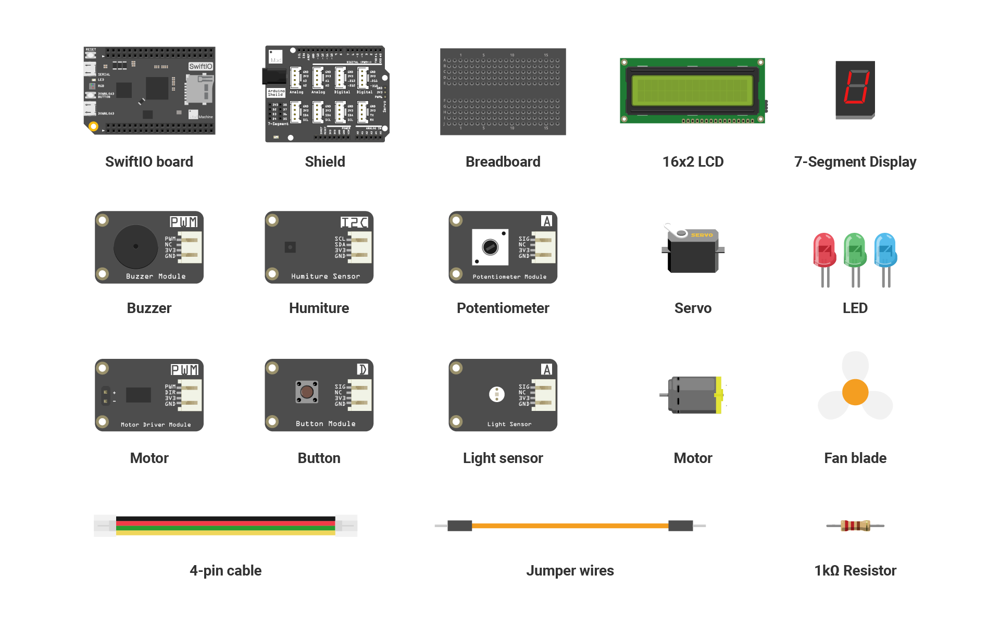

# SwiftIO Maker Kit

import DocCardList from '@theme/DocCardList';
import {useCurrentSidebarCategory} from '@docusaurus/theme-common';

This section is built around the SwiftIO Maker Kit. You will follow a dozen of missions/projects to try the modules one by one. 

In each mission, you will learn how to build the circuit, how everything works, how to program your board, etc.

Each mission walks you through the steps on how to build the circuit, program your board and download the code. Besides, you will learn some electronic knowledge and Swift concepts.

Here are some tips:
1. [Follow the step-by-step guide](../../overview/getting-started/overview.mdx) to get started.
2. At first, you could download all [example projects](https://github.com/madmachineio/MadExamples). Then follow the missions below. Here is a [guide](../../../overview/advanced/run-example) on running an example project.

<DocCardList items={useCurrentSidebarCategory().items}/>