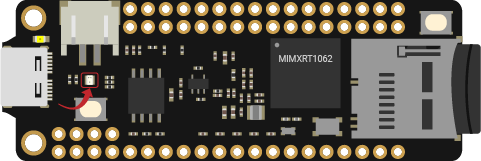
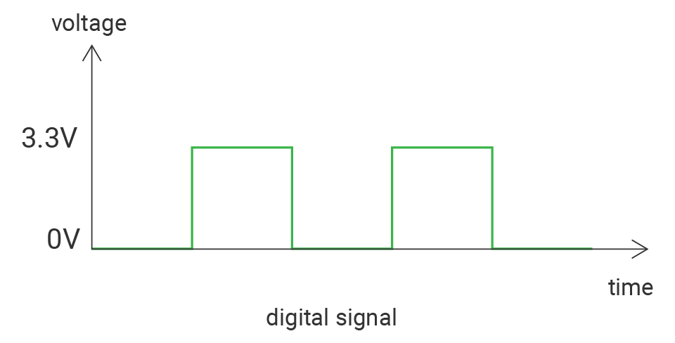
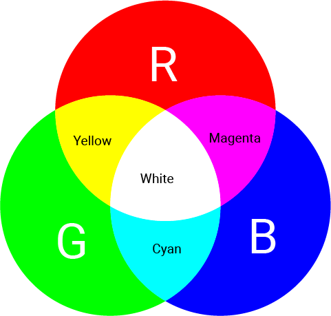

# Blink

Let's first come to an easy beginner project - blink the onboard LED. This example shows the simplest thing you can do with just a board to see physical output.

## What you need
- SwiftIO Feather (or SwiftIO board) 



:::note
The projects in the part General will use SwiftIO Feather for example. You can also use SwiftIO board instead. And you may need to change your code accordingly.
:::


## Circuit

For this project, you only need the board. There is a built-in RGB LED on the board as shown in the image above. You can control it using the methods in `DigitalOut` class.

Just plug the board into your computer with a USB cable to download your code.

## Example code
It's time for the code. Let's see how it works. You can find the example code at the bottom left corner of IDE:  GettingStarted > Blink.

``` swift
// Turn on and off the onboard LED continuously.

// Import the library to enable the relevant classes and functions.
import SwiftIO

// Import the board library to use the Id of the specific board.
import SwiftIOFeather

// Initialize the onboard green LED with other parameters set to default.
let green = DigitalOut(Id.GREEN)

// Blink the LED over and over again.
while true {
    // Apply a high votage and turn off the LED.
    green.write(true)
    // Keep the light off for a minute.
    sleep(ms: 1000)
    // Apply a low voltage and turn on the LED.
    green.write(false)
    // Keep the light on for a minute.
    sleep(ms: 1000)
}
```

## What you'll see

The green LED will be off and on alternatively.

## What is the digital signal?
The digital signal normally has two states, its value is either **1** or **0**. In our cases, 1 represents 3.3V, and 0 represents 0V. There are also other ways to express the same meaning: high or low, true or false. Now you will control the output voltage to turn on or off the LED.



## What is LED

The LED, or light-emitting diode, is one kind of diode. It has a positive leg (anode) and a negative leg (cathode). The long leg is positive and the short leg is negative. The current could only flow in one direction, from positive to negative. You should connect the positive leg to the current source.Only when you connect it in the right direction, the current could flow.

There are two ways to connect the LED:


1. Connect the LED to the digital pin and ground. If the pin outputs a **high** voltage, the current flows from the pin to the ground, the LED will be **on**. If it outputs a low voltage, the LED is off.

2. Connect the LED to the power and a digital pin. Since the current always flows from high to low voltage, if the pin outputs a **high** voltage, there is no voltage difference between the two ends of the LED, so the LED is **off**. Only when the pin outputs a low voltage, the current could flow from the power to the pin and the LED will be on. This is how the onboard LED works.


You can find a RGB LED on your board. It has three colors: red, green and blue. As you download the code, it serves as a status indicator. Besides, you could also control its color and state by setting the output voltage.



Since there are three colors, you could light any of them: if you turn on red and blue, you could notice it appears magenta. If all three are on, the LED seems to be white.

While the onboard LED is connected to 3.3V internally. If you set it to high voltage, there would actually be no current. So it will be lighted when you apply low voltage.

## Code analysis

``` swift
import SwiftIO
import SwiftIOFeather
```

[SwiftIO](https://swiftioapi.madmachine.io/) consists of all the functionalities to control your board. All programs must first reference it so that you can use everything in it, like classes and functions.

[SwiftIOFeather](https://github.com/madmachineio/MadBoards/blob/main/Sources/SwiftIOFeather/Id.swift) defines the corresponding pin id of the SwiftIO board. The pins of different boards are different. So this library tells the IDE you are dealing with the SwiftIO board, not any other boards. Then you could use the id in it.

``` swift
let green = DigitalOut(Id.GREEN)
```

Before you set a specific pin, you need to initialize it. `let` is a keyword for Swift language to declare constants. You will often use it to assign a name to the pin for easier reference later. 

This statement is to create an instance for `DigitalOut` class and initialize that pin. So you need to indicate its id. All ids are listed in an enum, and the built-in RGB LEDs use the id `RED`, `GREEN`, or `BLUE`, thus the id of blue LED here is written as `Id.GREEN` using dot syntax. 

``` swift
while true {

}
```

In the dead loop `while true`, all code in the brackets will run over and over again unless you power off the code. 

``` swift
green.write(true)
```

The method `write(_:)` is used to set the pin to output high or low voltage. Its parameter is a boolean type: true or false: true corresponds to a high level (3.3V) and false corresponds to a low level (0V). And as mentioned above, you need to set a low voltage to turn on the LED.

``` swift
sleep(ms: 1000)
```

The function `sleep(ms:)` is a global function and you can use it directly. It will stop the microcontroller's work for a specified period. So it needs the time as its parameter.

In the loop, the pin outputs high voltage and then sleeps for 1 second. So in the first 1s, there is always a high voltage. Similarly, in the next 1s, the pin outputs low voltage.


## See Also

[DigitalOut](https://swiftioapi.madmachine.io/Classes/DigitalOut.html) - this class is used to decide whether the pin output high or low voltage.

- `init(_:mode:value:)` - initialize the digital output pin. The first parameter needs the id. It is listed in the Id enumeration. The parameters mode and value have already their default value.

- `write(_:)` - set a specific pin to output high or low voltage. Its parameter is a boolean type: true or false. true corresponds to a high level and false corresponds to a low level.

[`sleep(ms:)`](https://swiftioapi.madmachine.io/Functions.html#/s:7SwiftIO5sleep2msySi_tF) - suspend the microcontroller's work and thus make the current state last for a certain time, measured in milliseconds.
