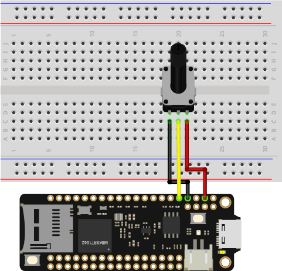
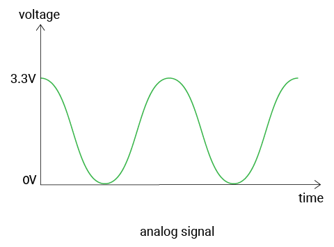
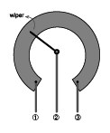

# Read analog input

So far, you've learned about digital signals. In this example, let's try analog signals. You'll use a potentiometer to get different results.


## What you need

- SwiftIO Feather (or SwiftIO board)
- Breadboard
- Potentiometer
- Jumper wires

## Circuit

Let's build the circuit now.

1. Place the potentiometer onto the breadboard.
2. Connect the first leg on the left to pin GND.
3. Connect the second leg to pin A0.
4. Connect the third leg goes to pin 3V3.



## Example code

You can find the example code at the bottom left corner of IDE:  / `GettingStarted` / `ReadAnalogInput`.

For the code, you will use the `AnalogIn` class.

```swift
// Read the input voltage on a specified analog pin. The value you get will be a decimal between 0.0 and 3.3.
// Import the library to enable the relevant classes and functions.
import SwiftIO

// Import the board library to use the Id of the specific board.
import SwiftIOFeather

// Initialize the pin A0 as a analog input pin.
let pin = AnalogIn(Id.A0)

// Read the input voltage every second.
while true {
    // Declare a constant to store the value you read from the analog pin.
    let value = pin.readVoltage()
    // Print the value and you can see it in the serial monitor.
    print(value)
    // Wait a second and then continue to read.
    sleep(ms: 1000)
}
```

## What you'll see

As you turn the potentiometer, the values printed on the screen change accordingly. They may gradually approach 0 or 3.3 depending on the direction you rotate.

## Background

### Analog input


You have known that the digital signal has determined values, and the analog signal is quite different. Its voltage changes smoothly with time. And its value ranges between 0V and 3.3V. So you can get 1.5V, 2V, 2.75V... There can be infinite possible values.



So how does the board read the values? Here comes the **analog to digital converter**. In brief, it converts the analog voltage to a digital value that the microcontroller can read. 

The converter has different precision, and the **resolution** describes the possible values it can measure. Our boards have a 12-bit resolution, which means there are 4096 (0-4095) values in total. The values from 0 to 4095 are known as **raw values**.

Let's see the working process in detail. When the board reads from the analog pin, it will first get a raw value between 0 and 4095, which will be mapped to voltage value proportionally. Here is the formula:

**resolution / reference voltage = raw value / actual voltage**

_where_

_resolution: 4096; reference voltage: 3.3V_

For example, if the raw value equals 0, the voltage would be 0V; if the raw value equals 4095, the voltage would be 3.3V; and 2047 corresponds 1.65V.

### Potentiometer

The potentiometer is one kind of variable resistor. You could adjust its resistance by rotating it clockwise or anticlockwise.



The resistance between ① and ③ is its maximum value. The wiper divides it into two parts. As the wiper moves, the resistance of the two parts will change accordingly.

## Code analysis

```swift
import SwiftIO
import SwiftIOFeather
```
Import the [**SwiftIO**](https://swiftioapi.madmachine.io/) library to use the related functionalities and the [**SwiftIOFeather**](https://github.com/madmachineio/MadBoards/blob/main/Sources/SwiftIOFeather/Id.swift) library to use the corresponding pin id. If you use the SwiftIO board, you need to import the `SwiftIOBoard` instead.

```swift
let pin = AnalogIn(Id.A0)
```
The potentiometer connects to pin A0, so you initialize it before using the pin.

```swift
let value = pin.readVoltage()
```
The method `.readVoltage()` returns directly the voltage value. The return value is a floating-point number between 0V-3.3V. 

``` swift
print(value)
```

Print the result directly to the serial port. You can view the results on the serial monitor.


## Reference

[AnalogIn](https://swiftioapi.madmachine.io/Classes/AnalogIn.html) - read the voltage from an analog pin.

- `init(_:)` - initialize an analog input pin. You need to tell the id of a specified pin to initialize it.

- `readVoltage()` - read the input voltage from a pin. It will return a float between 0 and 3.3.

[SwiftIOFeather](https://github.com/madmachineio/MadBoards/blob/main/Sources/SwiftIOFeather/Id.swift) - find the corresponding pin id of SwiftIO Feather board.