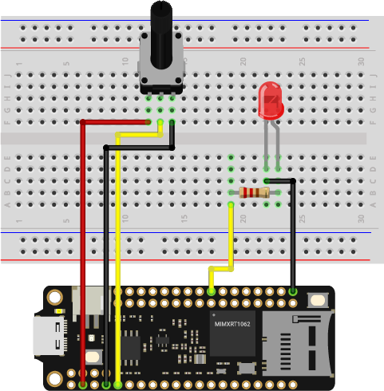

# Blink analog

In this example, you will use a potentiometer to control the flashing speed of an LED light. The speed will change as you turn it.

## What you need

- SwiftIO Feather (or SwiftIO board)
- Breadboard
- Potentiometer
- LED
- 330ohm resistor
- Jumper wires


## Circuit



Prepare the jumper wire cables, be aware of the female and male ends. Connect the male ends to the SwiftIO board at ports 3.3V, A6, and GND.

Connect the A6 wire to the middle pin of the potentiometer. Connect the GND wire to the outer pins of the potentiometer, and the 3.3V wire to the other outer pin of the potentiometer.

For the LED module, connect jumper wires to GND and SIG ports. Connect the GND wire to the GND port of SwiftIO, and connect the SIG wire to the D10 port.

## Code

```swift
// Read the analog input and use it to set the rate of LED blink.
// Import the library to enable the relevant classes and functions.
import SwiftIO

// Import the board library to use the Id of the specific board.
import SwiftIOBoard

// Initialize an analog input and a digital output pin the components are connected to,
let sensor = AnalogIn(Id.A0)
let led = DigitalOut(Id.D0)

// Enable the LED to blink over and over again.
while true {
    // Read the input voltage in percentage.
    let value = sensor.readRawValue()
    // Change the current LED state.
    led.toggle()
    // Keep the led on or off for a certain period determined by the value you get.
    sleep(ms: value)
}
```

## Instruction

`.readRawValue()` method reads the current raw value from the specified analog pin. Since the analog-to-digital converter on the SwiftIO Board has a resolution of 12-bit, therefore, the corresponding value would be 0-4095.

`.toggle()` method, as the name suggests, inverts the output level on a specific digital pin. For example, if the original output is a high voltage, then it will be changed to low voltage.

Between each `.toggle()`, a `sleep(ms: )` function with a parameter `value` is used. It makes sure that there's a certain amount of time between each toggle, and the time is under control.


